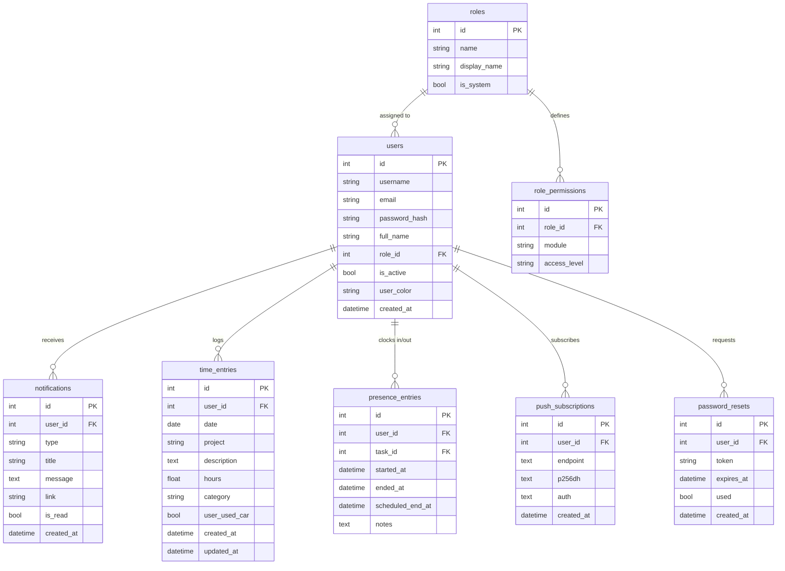
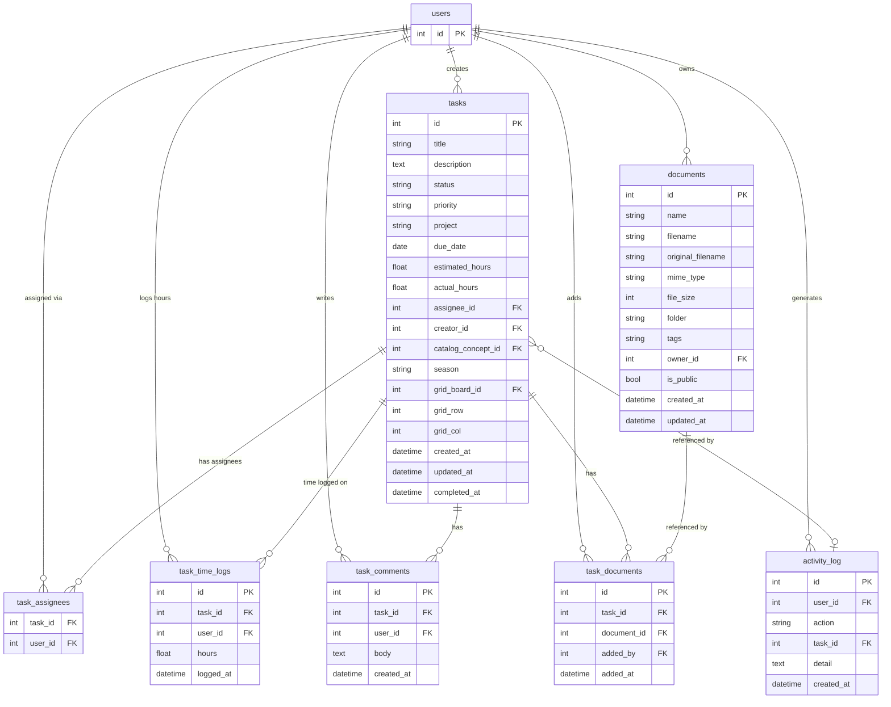
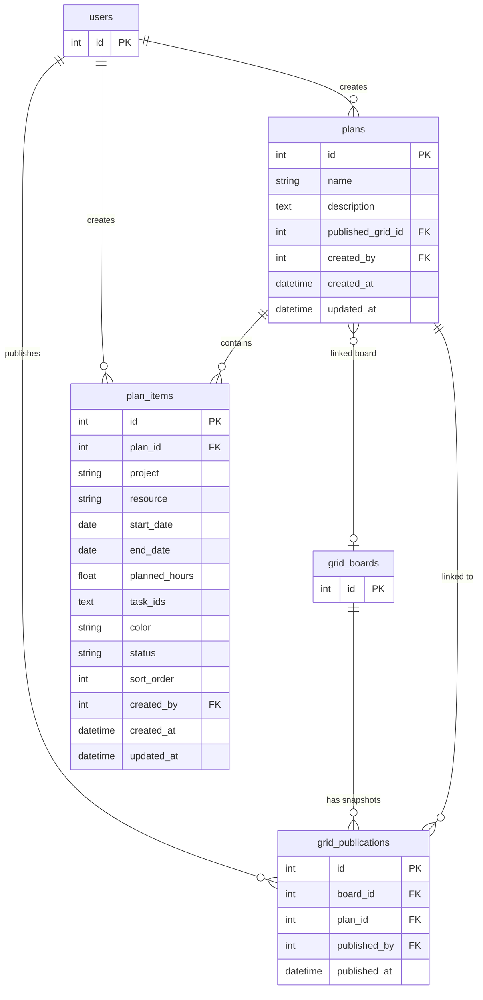
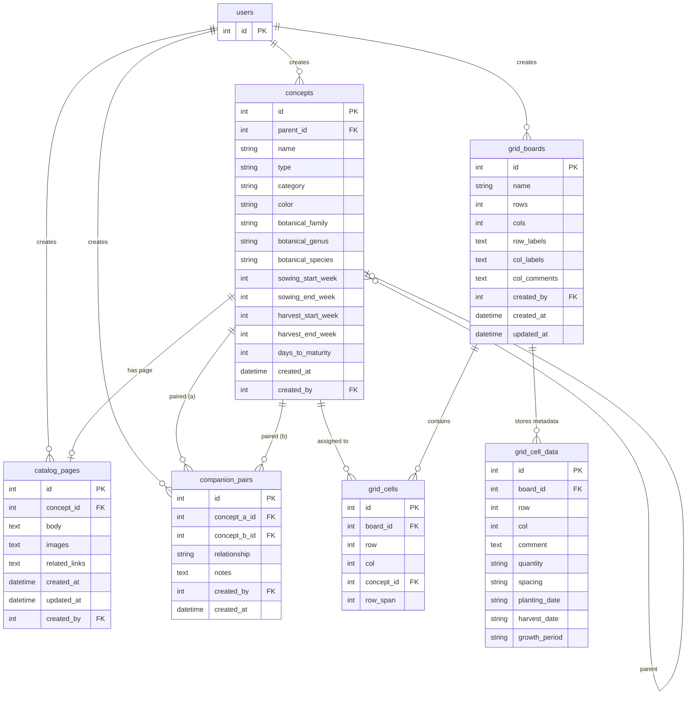
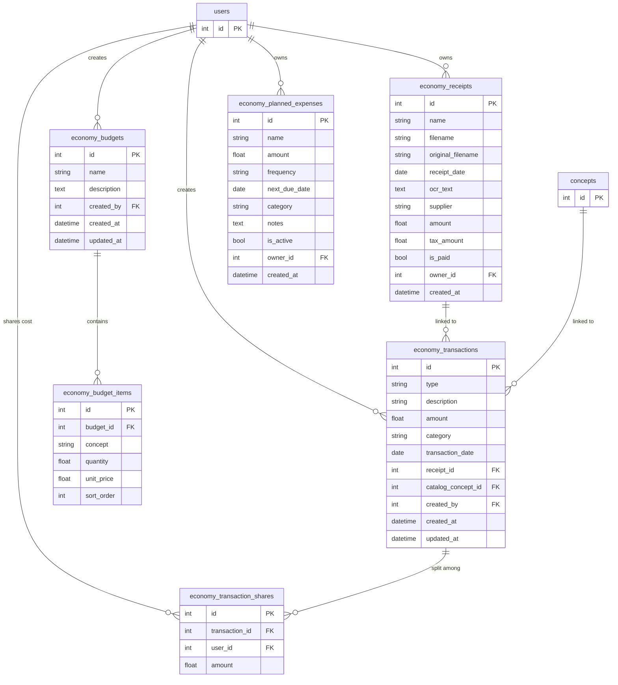
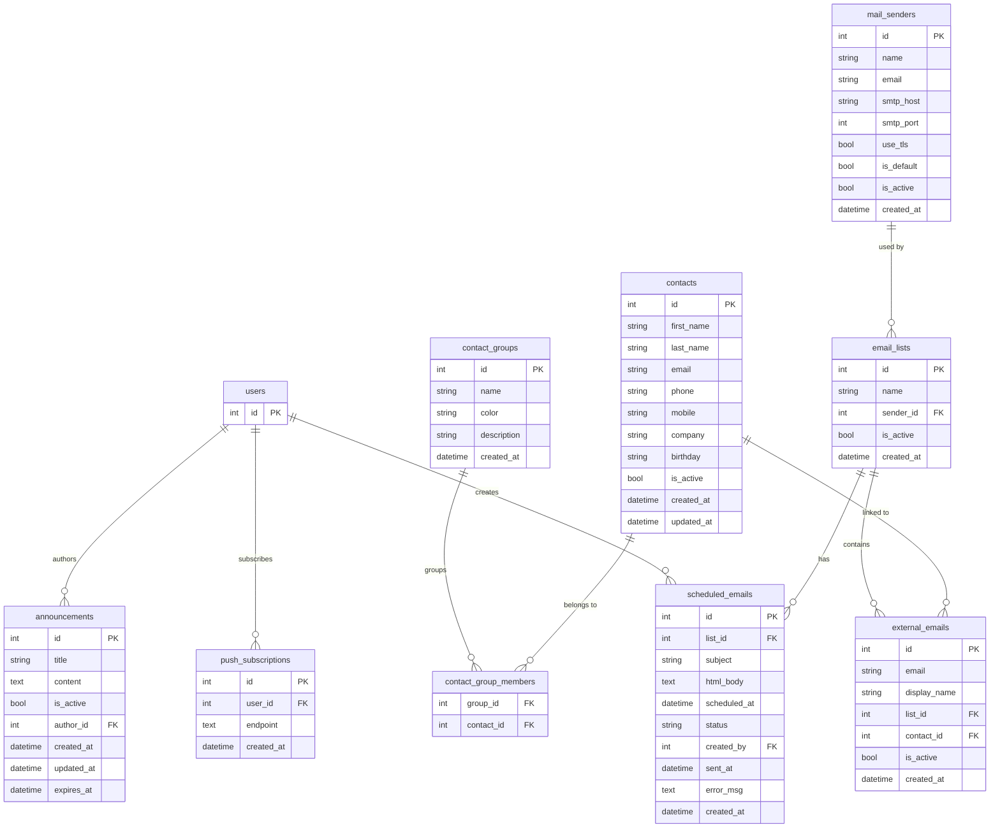
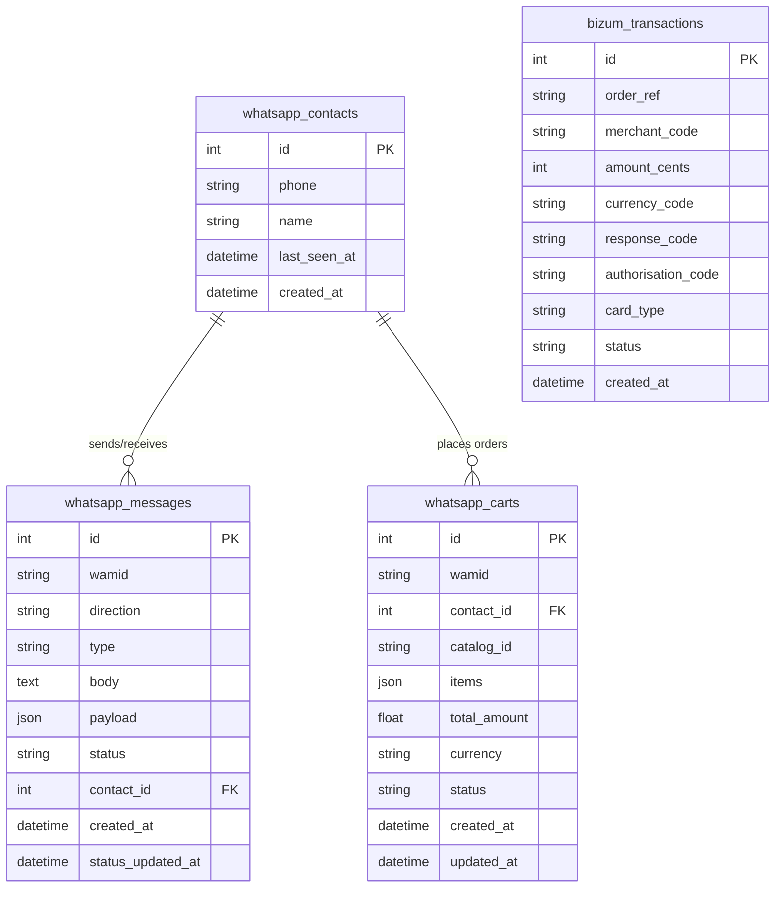
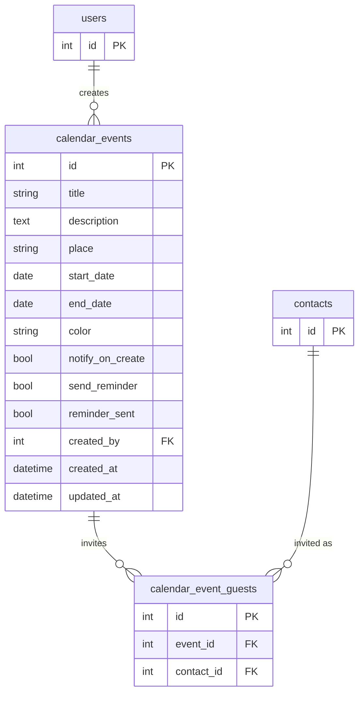

# Koljos – Relational Data Model

---

## Model file organisation

Models are grouped into domain subpackages under `app/models/`. All classes are re-exported from `app/models/__init__.py` so existing import paths are unaffected.

| Subpackage | Files |
|---|---|
| `users/` | `user.py`, `car.py`, `rbac.py`, `invitation.py`, `password_reset.py` |
| `comms/` | `announcement.py`, `mailing.py`, `notifications.py`, `push_subscription.py`, `contacts.py`, `contact_email.py`, `contact_phone.py`, `contact_group.py`, `whatsapp.py`, `scheduled_report.py`, `newsletter.py` |
| `content/` | `catalog.py`, `documents.py` |
| `planification/` | `planification.py`, `grid.py`, `weather.py`, `calendar.py` |
| `iot/` | `ewelink.py`, `sensors.py` |
| `sales/` | `sales.py`, `economy.py`, `bizum.py`, `gamification.py` |
| `work/` | `activity_log.py`, `audit_log.py`, `workforce.py`, `presence.py`, `inventory.py`, `maintenance.py`, `fuel_price.py`, `diary.py` |
| `farm/` | `harvest.py`, `irrigation.py`, `parcel.py`, `rotation.py`, `energy_carbon.py` |

---

## Tables overview

| Table | Description |
|-------|-------------|
| `roles` | Named permission roles (e.g. Administrador, Koljos Member) |
| `role_permissions` | Per-module access level for each role |
| `users` | Intranet user accounts; role assigned via FK to `roles` |
| `notifications` | In-app notifications per user |
| `time_entries` | Daily hours imputations per user and project |
| `tasks` | Tasks with status, priority, creator, and optional assignee |
| `task_comments` | Comments on tasks, cascade-deleted with parent task |
| `task_documents` | Association between tasks and documents |
| `documents` | Uploaded files in the document library |
| `plans` | Named planification groupings |
| `plan_items` | Resource-planning entries belonging to a plan |
| `concepts` | Named, hierarchical, colour-coded concepts used across features |
| `catalog_pages` | Rich editorial page attached to a single concept (one-to-one) |
| `companion_pairs` | Companion or antagonist planting relationships between two concepts |
| `grid_boards` | Named grids (rows × cols) for visual planning |
| `grid_cells` | Concept-to-cell assignments for a board |
| `grid_cell_data` | Per-cell agronomic metadata (planting notes, quantities, dates) |
| `grid_publications` | Immutable publish snapshots linking a board to a plan |
| `activity_log` | Audit trail of user actions on tasks |
| `audit_logs` | Security-oriented audit trail for sensitive mutations across all domains |
| `presence_entries` | Clock-in / clock-out presence records per user |
| `invitations` | Single-use email invitation tokens for new user self-registration |
| `announcements` | Company-wide rich-text announcements posted by any authenticated user |
| `push_subscriptions` | Browser Web Push endpoints stored per user for announcement push notifications |
| `mail_senders` | Hostinger SMTP accounts used as email senders in the mailing module |
| `diary_entries` | Work diary entries (Bitácora); one entry per author per work day, with free-text body |
| `diary_entry_attachments` | Media files (image, audio, video) attached to a diary entry; cascade-deleted with parent |
| `email_lists` | Named distribution lists of external email addresses |
| `external_emails` | Individual external email addresses belonging to an email list |
| `scheduled_emails` | Emails queued to be sent to an email list at a future datetime |
| `contacts` | Organisation address-book entries (company, social links); emails and phones in sub-tables |
| `contact_emails` | Email addresses belonging to a contact (globally unique) |
| `contact_phones` | Phone numbers belonging to a contact (globally unique) |
| `contact_groups` | Named, coloured labels for grouping contacts |
| `contact_group_members` | Many-to-many join between contacts and contact groups |
| `economy_receipt_folders` | Named folders for organising receipts in the Economy module |
| `economy_receipts` | Uploaded receipt images or photos in the Economy module |
| `economy_transactions` | Income and outcome entries in the Economy module |
| `economy_transaction_shares` | Cost-share records splitting an outcome transaction among users |
| `economy_budgets` | Named budget documents in the Economy module |
| `economy_budget_items` | Line items (concept, quantity, unit price) belonging to a budget |
| `economy_planned_expenses` | Recurring or one-off planned expenses for cashflow planning |
| `whatsapp_contacts` | Phone contacts who have interacted via WhatsApp Business |
| `whatsapp_messages` | Inbound and outbound WhatsApp messages (all types) |
| `whatsapp_carts` | Shopping cart/order events received via the WhatsApp catalog flow |
| `bizum_transactions` | Bizum/Redsys TPV Virtual payment notification records |
| `buyer_badge_defs` | Catalogue of gamification badges (seeded via deploy/seeds/seed_buyer_badges.py) |
| `buyer_badge_grants` | Junction table recording which Contact has earned which badge |
| `cars` | One vehicle per user, used for commute tracking and fuel cost estimation |
| `weather_hourly_logs` | Observed hourly weather data stored for historical analysis |
| `weather_daily_logs` | Observed daily weather summary data stored for historical analysis |
| `calendar_events` | User-created calendar events with optional creation notification and 24 h reminder |
| `calendar_event_guests` | Guest contacts invited to a calendar event |
| `task_assignees` | Many-to-many join between tasks and users (multiple assignees per task) |
| `task_time_logs` | Individual time-log entries: hours a user has logged against a task |
| `harvest_logs` | Individual harvest event recording quantity in kg per concept and grid cell |
| `rotation_plans` | Named crop rotation plans grouping grid-board seasons in sequence |
| `rotation_seasons` | Single season entry in a rotation plan linked to a grid board |
| `password_resets` | Single-use password-reset tokens for user-initiated password recovery |
| `inventory_items` | Named physical items (seeds, tools, consumables) tracked in stock |
| `inventory_movements` | Stock movement events (in/out/use/waste/adjustment) per inventory item |
| `sale_records` | Header record for a single sales transaction (buyer, channel, date) |
| `sale_lines` | Individual line item within a sale record: crop, kg, price per kg |
| `sale_products` | Saleable products composed of one or more catalog concepts with a unit price |
| `sale_product_ingredients` | Association between a product and a catalog concept with quantity |
| `sale_form_products` | Many-to-many join between sale forms and products |
| `sale_forms` | Public order forms that expose products to customers via a token URL |
| `sale_form_entries` | Customer submissions on a sale form (one per customer order) |
| `sale_form_entry_lines` | Individual product lines within a customer order entry |
| `irrigation_zones` | Named irrigation zones, optionally linked to a grid board and a remote actuator |
| `irrigation_events` | Individual water application events per zone (source, method, volume, duration) |
| `equipment` | Cooperative machinery and tools with status and next-service dates |
| `maintenance_logs` | Maintenance event records per equipment (scheduled, corrective, inspection) |
| `sensor_devices` | Registered IoT sensor devices identified by a unique device_id slug |
| `sensor_readings` | Time-series metric readings ingested from sensor devices |
| `task_dependencies` | Many-to-many join encoding blocking dependencies between tasks |
| `energy_carbon_entries` | Unified energy consumption and CO2e emission log (discriminator: `record_type`) |
| `parcels` | Named plots/parcels of land with coordinates, area, and soil type |
| `fuel_prices` | Latest national average fuel prices per type, updated daily from MINETUR API |
| `water_concessions` | DGA water extraction concessions with annual volumetric limits |
| `scheduled_reports` | Recurring automated report definitions sent to a list of email recipients |
| `newsletters` | Recurring automated digest email configurations with per-section selection |

---

## `roles`

Named permission roles stored in the database. System roles (`is_system = true`) cannot be deleted and the Administrador role's permission matrix is immutable.

| Column | Type | Constraints |
|--------|------|-------------|
| `id` | INTEGER | PK |
| `name` | VARCHAR(50) | UNIQUE, NOT NULL (slug, e.g. `admin`, `member`) |
| `display_name` | VARCHAR(100) | NOT NULL |
| `description` | TEXT | nullable |
| `is_system` | BOOLEAN | default `false` |
| `created_at` | DATETIME | |

**Default system roles:** `admin` (Administrador), `boss` (Koljoss Boss), `member` (Koljos Member), `sales` (Koljos Ventas), `guest` (Invitado).

---

## `role_permissions`

One row per role–module combination. Together they form the permission matrix for a role.

| Column | Type | Constraints |
|--------|------|-------------|
| `id` | INTEGER | PK |
| `role_id` | INTEGER | FK → `roles.id` ON DELETE CASCADE, NOT NULL |
| `module` | VARCHAR(50) | NOT NULL (slug, e.g. `catalog`, `economy`) |
| `access_level` | VARCHAR(20) | NOT NULL (`none` \| `viewer` \| `editor` \| `full`) |

`UNIQUE(role_id, module)` constraint.

**Modules:** activity, announcements, bizum, cars, catalog, contacts, documents, economy, grid, harvest, inventory, invitations, irrigation, mailing, maintenance, planification, presence, reports, roles, rotation, sales, sensors, tasks, users, weather, whatsapp, workforce.

---

## `users`

Central identity table. Every other table references it.

| Column | Type | Constraints |
|--------|------|-------------|
| `id` | INTEGER | PK |
| `username` | VARCHAR(80) | UNIQUE, NOT NULL |
| `email` | VARCHAR(120) | UNIQUE, NOT NULL |
| `password_hash` | VARCHAR(256) | NOT NULL |
| `full_name` | VARCHAR(150) | NOT NULL |
| `role_id` | INTEGER | FK → `roles.id`, nullable |
| `is_active` | BOOLEAN | default `true` |
| `user_color` | VARCHAR(7) | random hex colour, e.g. `#A3F2C1` |
| `created_at` | DATETIME | |
| `avatar_document_id` | INTEGER | FK → `documents.id`, nullable; `NULL` means generated initials avatar |
| `home_city` | VARCHAR(150) | nullable; city/municipality for commute calculations |
| `home_address` | VARCHAR(300) | nullable; street and number |
| `home_lat` | REAL | nullable; latitude from geocoding |
| `home_lon` | REAL | nullable; longitude from geocoding |
| `birth_month` | INTEGER | nullable; birth month (1–12), used to generate yearly birthday calendar events |
| `birth_day` | INTEGER | nullable; birth day of month (1–31) |

**Derived API fields (no DB column):** `avatar_url` — served at `/avatars/<id>`, generated on first request using `user_color` and `full_name` initials via Pillow. File stored at `<UPLOAD_FOLDER>/avatars/<id>.png`. `role` — slug of the linked `roles.name`; falls back to `"employee"` if `role_id` is null.

---

## `notifications`

One notification per user event. Polymorphic via `type`.

| Column | Type | Constraints |
|--------|------|-------------|
| `id` | INTEGER | PK |
| `user_id` | INTEGER | FK → `users.id`, NOT NULL |
| `type` | VARCHAR(50) | NOT NULL (`task_due` \| `task_assigned` \| `task_updated` \| `document_shared` \| `plan_changed` \| `system`) |
| `title` | VARCHAR(200) | NOT NULL |
| `message` | TEXT | |
| `link` | VARCHAR(500) | |
| `is_read` | BOOLEAN | default `false` |
| `created_at` | DATETIME | |

---

## `time_entries`

Daily hours imputations per user.

| Column | Type | Constraints |
|--------|------|-------------|
| `id` | INTEGER | PK |
| `user_id` | INTEGER | FK → `users.id`, NOT NULL |
| `date` | DATE | NOT NULL |
| `project` | VARCHAR(150) | NOT NULL |
| `description` | TEXT | |
| `hours` | FLOAT | NOT NULL |
| `category` | VARCHAR(80) | default `general` |
| `user_used_car` | BOOLEAN | default `false` — whether the user commuted by car for this entry |
| `created_at` | DATETIME | |
| `updated_at` | DATETIME | |

---

## `tasks`

Tasks with dual FK to `users` (creator and optional assignee) and optional links to the horticultural catalog and grid.

| Column | Type | Constraints |
|--------|------|-------------|
| `id` | INTEGER | PK |
| `title` | VARCHAR(200) | NOT NULL |
| `description` | TEXT | |
| `status` | VARCHAR(30) | `pending` \| `in_progress` \| `done` \| `cancelled` |
| `priority` | VARCHAR(20) | `low` \| `medium` \| `high` |
| `project` | VARCHAR(150) | |
| `due_date` | DATE | nullable |
| `estimated_hours` | FLOAT | nullable |
| `actual_hours` | FLOAT | nullable, cumulative hours logged against this task |
| `assignee_id` | INTEGER | FK → `users.id`, nullable |
| `creator_id` | INTEGER | FK → `users.id`, NOT NULL |
| `catalog_concept_id` | INTEGER | FK → `concepts.id`, nullable — links the task to a specific crop or product |
| `season` | VARCHAR(20) | nullable — `spring` \| `summer` \| `autumn` \| `winter` |
| `grid_board_id` | INTEGER | FK → `grid_boards.id`, nullable — pin to a specific plot on the grid |
| `grid_row` | INTEGER | nullable |
| `grid_col` | INTEGER | nullable |
| `created_at` | DATETIME | |
| `updated_at` | DATETIME | |
| `completed_at` | DATETIME | nullable |

---

## `task_comments`

Comments on tasks. Cascade-deleted with the parent task.

| Column | Type | Constraints |
|--------|------|-------------|
| `id` | INTEGER | PK |
| `task_id` | INTEGER | FK → `tasks.id` ON DELETE CASCADE, NOT NULL |
| `user_id` | INTEGER | FK → `users.id`, NOT NULL |
| `body` | TEXT | NOT NULL |
| `created_at` | DATETIME | |

---

## `task_documents`

Association table linking tasks to documents. Both FKs cascade on delete. Unique on (`task_id`, `document_id`).

| Column | Type | Constraints |
|--------|------|-------------|
| `id` | INTEGER | PK |
| `task_id` | INTEGER | FK → `tasks.id` ON DELETE CASCADE, NOT NULL |
| `document_id` | INTEGER | FK → `documents.id` ON DELETE CASCADE, NOT NULL |
| `added_by` | INTEGER | FK → `users.id`, NOT NULL |
| `added_at` | DATETIME | |

---

## `task_assignees`

Many-to-many join between tasks and users recording multiple assignees per task. Both FKs cascade on delete.

| Column | Type | Constraints |
|--------|------|-------------|
| `task_id` | INTEGER | PK, FK → `tasks.id` ON DELETE CASCADE |
| `user_id` | INTEGER | PK, FK → `users.id` ON DELETE CASCADE |

---

## `task_time_logs`

Records each time a user logs hours against a task. Used to populate `tasks.actual_hours` and the per-task time-logger list. Cascade-deleted with the parent task.

| Column | Type | Constraints |
|--------|------|-------------|
| `id` | INTEGER | PK |
| `task_id` | INTEGER | FK → `tasks.id` ON DELETE CASCADE, NOT NULL |
| `user_id` | INTEGER | FK → `users.id`, NOT NULL |
| `hours` | FLOAT | NOT NULL |
| `logged_at` | DATETIME | |

---

## `documents`

Uploaded files. Physical file stored with a UUID-prefixed `filename`.

| Column | Type | Constraints |
|--------|------|-------------|
| `id` | INTEGER | PK |
| `name` | VARCHAR(255) | NOT NULL |
| `description` | TEXT | |
| `filename` | VARCHAR(255) | NOT NULL (stored name) |
| `original_filename` | VARCHAR(255) | NOT NULL |
| `mime_type` | VARCHAR(100) | |
| `file_size` | INTEGER | bytes |
| `folder` | VARCHAR(255) | default `/` |
| `tags` | VARCHAR(500) | comma-separated |
| `owner_id` | INTEGER | FK → `users.id`, NOT NULL |
| `is_public` | BOOLEAN | default `false` |
| `created_at` | DATETIME | |
| `updated_at` | DATETIME | |

---

## `plans`

Named planification groupings. Each plan owns a set of `plan_items`. When created from a published grid the `name` captures the board name at publish time and `published_grid_id` links back to the source board.

| Column | Type | Constraints |
|--------|------|-----------|
| `id` | INTEGER | PK |
| `name` | VARCHAR(200) | nullable — board name captured at publish time |
| `description` | TEXT | |
| `published_grid_id` | INTEGER | FK → `grid_boards.id`, nullable |
| `created_by` | INTEGER | FK → `users.id`, NOT NULL |
| `created_at` | DATETIME | |
| `updated_at` | DATETIME | |

---

## `plan_items`

Resource-planning entries that belong to a plan.

| Column | Type | Constraints |
|--------|------|-------------|
| `id` | INTEGER | PK |
| `plan_id` | INTEGER | FK → `plans.id`, nullable |
| `project` | VARCHAR(150) | NOT NULL |
| `resource` | VARCHAR(150) | NOT NULL (free text — person or team) |
| `start_date` | DATE | NOT NULL |
| `end_date` | DATE | NOT NULL |
| `planned_hours` | FLOAT | |
| `description` | TEXT | |
| `color` | VARCHAR(20) | hex colour |
| `status` | VARCHAR(30) | `planned` \| `confirmed` \| `done` |
| `task_ids` | TEXT | JSON array of linked task IDs |
| `sort_order` | INTEGER | user-defined display order, default `0` |
| `created_by` | INTEGER | FK → `users.id`, NOT NULL |
| `created_at` | DATETIME | |
| `updated_at` | DATETIME | |

---

## `catalog_pages`

Rich editorial page attached to a single concept (one-to-one). Cascade-deleted when the concept is removed.

| Column | Type | Constraints |
|--------|------|-------------|
| `id` | INTEGER | PK |
| `concept_id` | INTEGER | FK → `concepts.id` ON DELETE CASCADE, NOT NULL, UNIQUE |
| `body` | TEXT | long-form description |
| `images` | TEXT | JSON array of image paths / URLs |
| `related_links` | TEXT | JSON array of `{label, url}` objects |
| `created_at` | DATETIME | |
| `updated_at` | DATETIME | |
| `created_by` | INTEGER | FK → `users.id`, NOT NULL |

---

## `companion_pairs`

Records a companion or antagonist relationship between two catalog concepts (typically plant species). Each pair is stored once in canonical order (`concept_a_id < concept_b_id`) with a unique constraint to prevent duplicates. The API layer enforces the ordering so callers can address the pair from either direction.

| Column | Type | Constraints |
|--------|------|-------------|
| `id` | INTEGER | PK |
| `concept_a_id` | INTEGER | FK → `concepts.id` ON DELETE CASCADE, NOT NULL |
| `concept_b_id` | INTEGER | FK → `concepts.id` ON DELETE CASCADE, NOT NULL |
| `relationship` | VARCHAR(20) | `companion` or `antagonist`, NOT NULL |
| `notes` | TEXT | Optional free-text explanation |
| `created_by` | INTEGER | FK → `users.id`, NOT NULL |
| `created_at` | DATETIME | |

Unique index: `uq_companion_pair (concept_a_id, concept_b_id)`.

---

## `grid_boards`

Named grids (rows × cols) for visual planning.

| Column | Type | Constraints |
|--------|------|-------------|
| `id` | INTEGER | PK |
| `name` | VARCHAR(200) | NOT NULL |
| `rows` | INTEGER | |
| `cols` | INTEGER | |
| `row_labels` | TEXT | JSON array of label strings |
| `col_labels` | TEXT | JSON array of label strings |
| `col_comments` | TEXT | JSON array of comment strings |
| `created_by` | INTEGER | FK → `users.id`, NOT NULL |
| `created_at` | DATETIME | |
| `updated_at` | DATETIME | |

---

## `concepts`

Standalone, hierarchical, colour-coded concepts. Self-referencing via `parent_id` to support concept trees. Used as the assignable unit for grid cells and other features. Optional botanical metadata supports crop-rotation analysis and companion planting.

| Column | Type | Constraints |
|--------|------|-------------|
| `id` | INTEGER | PK |
| `parent_id` | INTEGER | FK → `concepts.id`, nullable (root concept when NULL) |
| `name` | VARCHAR(150) | NOT NULL |
| `type` | VARCHAR(80) | NOT NULL |
| `category` | VARCHAR(80) | |
| `color` | VARCHAR(20) | hex colour |
| `botanical_family` | VARCHAR(100) | nullable (e.g. `Solanaceae`) |
| `botanical_genus` | VARCHAR(100) | nullable (e.g. `Solanum`) |
| `botanical_species` | VARCHAR(150) | nullable (e.g. `Solanum lycopersicum`) |
| `sowing_start_week` | INTEGER | nullable, ISO week 1–52 |
| `sowing_end_week` | INTEGER | nullable, ISO week 1–52 |
| `harvest_start_week` | INTEGER | nullable, ISO week 1–52 |
| `harvest_end_week` | INTEGER | nullable, ISO week 1–52 |
| `days_to_maturity` | INTEGER | nullable |
| `created_at` | DATETIME | |
| `created_by` | INTEGER | FK → `users.id`, NOT NULL |

---

## `grid_cells`

Concept-to-cell assignments. One row per filled cell (or per merged-cell anchor). Unique on (`board_id`, `row`, `col`). Cascade-deleted when the board is removed.

A merged cell is stored as a single anchor row at the topmost row of the span. The `row_span` column records how many rows are covered. Interior rows of a span have no `grid_cells` record; rows beyond the span remain independent.

| Column | Type | Constraints |
|--------|------|-----------|
| `id` | INTEGER | PK |
| `board_id` | INTEGER | FK → `grid_boards.id` ON DELETE CASCADE, NOT NULL |
| `row` | INTEGER | NOT NULL |
| `col` | INTEGER | NOT NULL |
| `concept_id` | INTEGER | FK → `concepts.id`, nullable |
| `row_span` | INTEGER | NOT NULL, default `1`; `> 1` marks a merged vertical cell |
| | | UNIQUE(`board_id`, `row`, `col`) |

---

## `grid_cell_data`

Per-cell agronomic metadata for a board cell. Separate from `grid_cells` so metadata can survive a concept being cleared from a cell.

| Column | Type | Constraints |
|--------|------|-------------|
| `id` | INTEGER | PK |
| `board_id` | INTEGER | FK → `grid_boards.id` ON DELETE CASCADE, NOT NULL |
| `row` | INTEGER | NOT NULL |
| `col` | INTEGER | NOT NULL |
| `comment` | TEXT | |
| `quantity` | VARCHAR(100) | |
| `spacing` | VARCHAR(100) | |
| `planting_date` | VARCHAR(20) | |
| `harvest_date` | VARCHAR(20) | |
| `growth_period` | VARCHAR(100) | |
| | | UNIQUE(`board_id`, `row`, `col`) |

---

## `grid_publications`

Immutable snapshot record created each time a grid board is published. Multiple publications can exist per board; editing the live grid never affects existing publications.

| Column | Type | Constraints |
|--------|------|-----------|
| `id` | INTEGER | PK |
| `board_id` | INTEGER | FK → `grid_boards.id`, NOT NULL |
| `plan_id` | INTEGER | FK → `plans.id`, NOT NULL |
| `published_by` | INTEGER | FK → `users.id`, NOT NULL |
| `published_at` | DATETIME | NOT NULL |

---

## `audit_logs`

Security-oriented, append-only audit trail for sensitive mutations (role changes, user deactivation, financial deletions, payment toggles). Written by `log_audit()` in `app/routes/helpers.py`. Rows are never deleted.

| Column | Type | Constraints |
|--------|------|-------------|
| `id` | INTEGER | PK |
| `actor_id` | INTEGER | FK → `users.id` ON DELETE SET NULL, nullable, INDEXED |
| `action` | VARCHAR(100) | NOT NULL, INDEXED (e.g. `roles.create`, `users.deactivate`, `sales.payment_toggled`) |
| `target_type` | VARCHAR(80) | nullable (model class name, e.g. `Role`, `User`, `SaleRecord`) |
| `target_id` | INTEGER | nullable (PK of the affected row) |
| `detail` | TEXT | JSON blob with extra context; nullable |
| `created_at` | DATETIME | INDEXED, set to UTC now on insert |

---

## `activity_log`

Audit trail of user actions on tasks. Rows are append-only; the `task_id` FK uses `SET NULL` on task deletion so history is preserved.

| Column | Type | Constraints |
|--------|------|-------------|
| `id` | INTEGER | PK |
| `user_id` | INTEGER | FK → `users.id`, NOT NULL |
| `action` | VARCHAR(50) | NOT NULL (`create_task` \| `view_task` \| `update_status` \| `add_comment`) |
| `task_id` | INTEGER | FK → `tasks.id` ON DELETE SET NULL, nullable |
| `detail` | TEXT | extra context (task title, new status, comment excerpt) |
| `created_at` | DATETIME | |

---

## `presence_entries`

Clock-in / clock-out records. An entry with `ended_at = NULL` is the user's current active session. At most one active entry per user is allowed at any time, enforced both by application logic and by a partial unique index on `(user_id) WHERE ended_at IS NULL`.

| Column | Type | Constraints |
|--------|------|-------------|
| `id` | INTEGER | PK |
| `user_id` | INTEGER | FK → `users.id`, NOT NULL |
| `task_id` | INTEGER | FK → `tasks.id` ON DELETE SET NULL, nullable |
| `started_at` | DATETIME | NOT NULL |
| `ended_at` | DATETIME | nullable (NULL = active session), INDEXED |
| `scheduled_end_at` | DATETIME | nullable; set when the user chooses a fixed duration at clock-in |
| `notes` | TEXT | |
| `used_car` | BOOLEAN | NOT NULL, default `false` — set at clock-out when the user commuted by car |

Partial unique index: `uq_active_presence (user_id) WHERE ended_at IS NULL`.

---

## `invitations`

Single-use email invitation tokens. An admin sends an invitation to an email address; the recipient follows the link to self-register. The token is marked as used once registration is complete or is automatically invalid after `expires_at`.

| Column | Type | Constraints |
|--------|------|-------------|
| `id` | INTEGER | PK |
| `email` | VARCHAR(120) | NOT NULL |
| `token` | VARCHAR(64) | UNIQUE, NOT NULL, INDEXED |
| `role_id` | INTEGER | FK → `roles.id`, nullable |
| `invited_by` | INTEGER | FK → `users.id`, nullable |
| `expires_at` | DATETIME | NOT NULL |
| `used` | BOOLEAN | default `false` |
| `created_at` | DATETIME | |

---

## `password_resets`

Single-use password-reset tokens. A link is sent by email to the user; the token is marked as used once the password is changed and expires after a short TTL.

| Column | Type | Constraints |
|--------|------|-------------|
| `id` | INTEGER | PK |
| `user_id` | INTEGER | FK → `users.id`, NOT NULL |
| `token` | VARCHAR(64) | UNIQUE, NOT NULL, INDEXED |
| `expires_at` | DATETIME | NOT NULL |
| `used` | BOOLEAN | default `false` |
| `created_at` | DATETIME | |

---

## `task_dependencies`

Many-to-many join encoding blocking dependencies between tasks. Both FKs cascade on delete. A row `(task_id, depends_on_id)` means task `task_id` cannot be completed until `depends_on_id` is done.

| Column | Type | Constraints |
|--------|------|--------------|
| `task_id` | INTEGER | PK, FK → `tasks.id` ON DELETE CASCADE |
| `depends_on_id` | INTEGER | PK, FK → `tasks.id` ON DELETE CASCADE |

---

## `energy_carbon_entries`

Unified energy consumption and CO2e emission log. The `record_type` discriminator selects which set of domain-specific fields applies. Energy records capture consumption by activity and fuel type; carbon records capture emissions by category.

| Column | Type | Constraints |
|--------|------|-------------|
| `id` | INTEGER | PK |
| `record_type` | VARCHAR(10) | NOT NULL, INDEXED — `energy` \| `carbon` |
| `entry_date` | DATE | NOT NULL, INDEXED |
| `activity` | VARCHAR(30) | nullable (energy records only) |
| `energy_type` | VARCHAR(30) | nullable (energy records only) |
| `cost_eur` | FLOAT | nullable (energy records only) |
| `unit_price_eur` | FLOAT | nullable — price per unit snapshotted at creation |
| `category` | VARCHAR(30) | nullable (carbon records only) |
| `activity_description` | VARCHAR(250) | nullable (carbon records only) |
| `quantity` | FLOAT | nullable |
| `co2e_kg` | FLOAT | nullable — mandatory for carbon records; optional on energy records |
| `unit` | VARCHAR(20) | nullable |
| `notes` | TEXT | |
| `logged_by` | INTEGER | FK → `users.id`, NOT NULL |
| `created_at` | DATETIME | |

---

## `parcels`

Named plots or parcels of land. Coordinates enable site-specific weather lookups. One parcel may be marked as the default for weather forecasts.

| Column | Type | Constraints |
|--------|------|-------------|
| `id` | INTEGER | PK |
| `name` | VARCHAR(120) | UNIQUE, NOT NULL |
| `description` | TEXT | |
| `lat` | REAL | nullable — WGS84 latitude |
| `lon` | REAL | nullable — WGS84 longitude |
| `area_ha` | FLOAT | nullable — surface area in hectares |
| `soil_type` | VARCHAR(30) | nullable (`loamy` \| `sandy` \| `clay` \| `silty` \| `peaty` \| `chalky` \| `other`) |
| `notes` | TEXT | |
| `is_default` | BOOLEAN | default `false` |
| `created_by` | INTEGER | FK → `users.id`, NOT NULL, INDEXED |
| `created_at` | DATETIME | |
| `updated_at` | DATETIME | |

---

## `fuel_prices`

Latest known national average fuel prices. One row per fuel type; the scheduler upserts this table daily from the MINETUR carburantes API. Used as the price reference when creating energy consumption entries.

| Column | Type | Constraints |
|--------|------|-------------|
| `id` | INTEGER | PK |
| `fuel_type` | VARCHAR(20) | UNIQUE, NOT NULL (`gasoline` \| `diesel` \| `lpg` \| `electricity`) |
| `price_eur_per_unit` | FLOAT | NOT NULL — EUR per litre (liquids) or EUR per kWh (electricity) |
| `source` | VARCHAR(20) | NOT NULL (`api` \| `default`) |
| `fetched_at` | DATETIME | NOT NULL |
| `updated_at` | DATETIME | NOT NULL |

---

## `water_concessions`

DGA water extraction concessions in Aragon. Each concession has an annual volumetric limit (m3). Irrigation zones can be linked to a concession to track cumulative usage against the permitted limit.

| Column | Type | Constraints |
|--------|------|-------------|
| `id` | INTEGER | PK |
| `name` | VARCHAR(150) | NOT NULL |
| `dga_reference` | VARCHAR(100) | nullable — official expediente reference number |
| `annual_limit_m3` | FLOAT | NOT NULL — annual extraction limit in cubic metres |
| `valid_from` | DATE | nullable |
| `valid_to` | DATE | nullable |
| `notes` | TEXT | |
| `created_by` | INTEGER | FK → `users.id`, NOT NULL |
| `created_at` | DATETIME | |

---

## `newsletters`

Newsletter configurations for recurring automated digest emails. Each newsletter references an email list and an optional contact group. The scheduler generates a `ScheduledEmail` row when `next_send_at <= now`.

| Column | Type | Constraints |
|--------|------|-------------|
| `id` | INTEGER | PK |
| `name` | VARCHAR(150) | NOT NULL |
| `subject_template` | VARCHAR(300) | NOT NULL — supports `{date_range}` placeholder |
| `list_id` | INTEGER | FK → `email_lists.id`, NOT NULL |
| `group_id` | INTEGER | FK → `contact_groups.id`, nullable, SET NULL on delete |
| `frequency` | VARCHAR(16) | NOT NULL (`weekly` \| `biweekly` \| `monthly`) |
| `send_weekday` | INTEGER | NOT NULL, default 0 (0 = Monday … 6 = Sunday; ignored for monthly) |
| `send_hour` | INTEGER | NOT NULL, default 8 (UTC hour) |
| `sections` | JSON | Ordered list of section key strings to render |
| `cta_label` | VARCHAR(100) | nullable — call-to-action button label |
| `cta_url` | VARCHAR(300) | nullable — call-to-action button URL |
| `is_active` | BOOLEAN | NOT NULL, default `true` |
| `last_sent_at` | DATETIME (tz) | nullable |
| `next_send_at` | DATETIME (tz) | nullable, indexed |
| `created_by` | INTEGER | FK → `users.id`, nullable |
| `created_at` | DATETIME | |

---

## `scheduled_reports`

Recurring automated report definitions. The scheduler reads active records and sends the corresponding report type to the listed recipients at the configured frequency.

| Column | Type | Constraints |
|--------|------|-------------|
| `id` | INTEGER | PK |
| `name` | VARCHAR(150) | NOT NULL |
| `report_type` | VARCHAR(32) | NOT NULL (`presence` \| `sales` \| `harvest` \| `inventory`) |
| `frequency` | VARCHAR(16) | NOT NULL (`daily` \| `weekly` \| `monthly`) |
| `recipients` | JSON | NOT NULL — list of email address strings |
| `is_active` | BOOLEAN | NOT NULL, default `true` |
| `last_sent_at` | DATETIME | nullable |
| `created_by` | INTEGER | FK → `users.id`, nullable |
| `created_at` | DATETIME | |

---

## `announcements`

Company-wide announcements. Any authenticated user may create one. Only the author or an admin may edit or delete. Active announcements appear on the home page.

| Column | Type | Constraints |
|--------|------|-------------|
| `id` | INTEGER | PK |
| `title` | VARCHAR(200) | NOT NULL |
| `content` | TEXT | Sanitized HTML (bold, italic, underline, links, lists only) |
| `is_active` | BOOLEAN | default `true` — inactive announcements are hidden from the home page |
| `author_id` | INTEGER | FK → `users.id`, NOT NULL |
| `created_at` | DATETIME | |
| `updated_at` | DATETIME | auto-updated on `PATCH` |
| `expires_at` | DATETIME | nullable — when set, the scheduler deactivates the announcement automatically once this timestamp passes |

---

## `push_subscriptions`

Browser Web Push subscriptions. One row per browser/device per user. Stale subscriptions (HTTP 410 response from the push service) are automatically removed when a push is attempted.

| Column | Type | Constraints |
|--------|------|-------------|
| `id` | INTEGER | PK |
| `user_id` | INTEGER | FK → `users.id`, NOT NULL |
| `endpoint` | TEXT | UNIQUE, NOT NULL — full push service URL |
| `p256dh` | TEXT | NOT NULL — browser ECDH public key (base64url) |
| `auth` | TEXT | NOT NULL — symmetric auth secret (base64url) |
| `created_at` | DATETIME | |

---

## `mail_senders`

Hostinger SMTP accounts used as email senders by the mailing module.

| Column | Type | Constraints |
|--------|------|-------------|
| `id` | INTEGER | PK |
| `name` | VARCHAR(150) | NOT NULL — display name, e.g. "Koljos Notificaciones" |
| `email` | VARCHAR(254) | UNIQUE, NOT NULL |
| `smtp_host` | VARCHAR(255) | NOT NULL, default `smtp.hostinger.com` |
| `smtp_port` | INTEGER | NOT NULL, default `587` |
| `use_tls` | BOOLEAN | NOT NULL, default `true` (STARTTLS); `false` uses SMTP_SSL |
| `username` | VARCHAR(254) | NOT NULL — SMTP login |
| `password` | VARCHAR(256) | NOT NULL — SMTP password (admin-only access) |
| `is_default` | BOOLEAN | NOT NULL, default `false` — at most one row should be `true` |
| `is_active` | BOOLEAN | NOT NULL, default `true` |
| `created_at` | DATETIME | |

---

## `email_lists`

Named distribution lists of external email addresses. A built-in `"Announcements"` list is seeded on first run and used by the announcements module to deliver emails to external subscribers.

| Column | Type | Constraints |
|--------|------|-------------|
| `id` | INTEGER | PK |
| `name` | VARCHAR(150) | UNIQUE, NOT NULL |
| `description` | TEXT | |
| `sender_id` | INTEGER | FK → `mail_senders.id`, nullable — overrides default sender |
| `is_active` | BOOLEAN | NOT NULL, default `true` |
| `created_at` | DATETIME | |

---

## `external_emails`

Individual email addresses belonging to an email list. May optionally be linked to a `contacts` record.

| Column | Type | Constraints |
|--------|------|-------------|
| `id` | INTEGER | PK |
| `email` | VARCHAR(254) | NOT NULL |
| `display_name` | VARCHAR(150) | |
| `list_id` | INTEGER | FK → `email_lists.id`, NOT NULL |
| `contact_id` | INTEGER | FK → `contacts.id`, nullable, SET NULL on delete |
| `is_active` | BOOLEAN | NOT NULL, default `true` |
| `created_at` | DATETIME | |

Unique constraint: `(email, list_id)` — same address cannot appear twice in the same list.

---

## `scheduled_emails`

Emails queued to be sent to an email list at a future datetime. The background scheduler checks every 5 minutes and dispatches pending records whose `scheduled_at` has passed.

| Column | Type | Constraints |
|--------|------|-------------|
| `id` | INTEGER | PK |
| `list_id` | INTEGER | FK → `email_lists.id`, CASCADE on delete, NOT NULL |
| `subject` | VARCHAR(300) | NOT NULL |
| `html_body` | TEXT | NOT NULL |
| `scheduled_at` | DATETIME (TZ) | NOT NULL, indexed |
| `status` | VARCHAR(20) | NOT NULL, default `'pending'`; values: `pending`, `sent`, `failed`, `cancelled` |
| `created_by` | INTEGER | FK → `users.id`, NOT NULL |
| `sent_at` | DATETIME (TZ) | nullable |
| `error_msg` | TEXT | nullable |
| `created_at` | DATETIME | |

---

## `contacts`

Organisation address-book entries. Each record holds company information and optional social links. Email addresses and phone numbers are stored in the dedicated sub-tables `contact_emails` and `contact_phones`. Contacts can be linked to mailing list members (`external_emails.contact_id`), so membership can be driven from a single canonical record.

> **Note:** The legacy columns `email`, `phone`, and `mobile` remain on the SQLite disk schema as dead columns for backward compatibility but are no longer used; all reads and writes go through the sub-tables.

| Column | Type | Constraints |
|--------|------|-------------|
| `id` | INTEGER | PK |
| `first_name` | VARCHAR(100) | NOT NULL |
| `last_name` | VARCHAR(100) | default `''` |
| `company` | VARCHAR(150) | default `''` |
| `notes` | TEXT | default `''` |
| `website` | VARCHAR(500) | default `''` |
| `instagram` | VARCHAR(100) | default `''` |
| `linkedin` | VARCHAR(200) | default `''` |
| `tiktok` | VARCHAR(100) | default `''` |
| `facebook` | VARCHAR(200) | default `''` |
| `other_social` | VARCHAR(255) | default `''` |
| `is_active` | BOOLEAN | NOT NULL, default `true` |
| `user_id` | INTEGER | FK → `users.id`, nullable, SET NULL on delete |
| `birthday` | DATE | nullable |
| `created_at` | DATETIME | |
| `updated_at` | DATETIME | |

**Relationships:** `emails` → `contact_emails` (cascade delete-orphan), `phones` → `contact_phones` (cascade delete-orphan).

---

## `contact_emails`

Individual email addresses belonging to a contact. Each address is globally unique across all contacts.

| Column | Type | Constraints |
|--------|------|-------------|
| `id` | INTEGER | PK |
| `contact_id` | INTEGER | FK → `contacts.id` CASCADE, NOT NULL, indexed |
| `email` | VARCHAR(254) | UNIQUE, NOT NULL |
| `description` | VARCHAR(100) | default `''` (e.g. `"trabajo"`, `"personal"`) |
| `is_primary` | BOOLEAN | NOT NULL, default `false` |
| `created_at` | DATETIME | |

---

## `contact_phones`

Individual phone numbers belonging to a contact. Each number is globally unique across all contacts.

| Column | Type | Constraints |
|--------|------|-------------|
| `id` | INTEGER | PK |
| `contact_id` | INTEGER | FK → `contacts.id` CASCADE, NOT NULL, indexed |
| `phone` | VARCHAR(30) | UNIQUE, NOT NULL |
| `description` | VARCHAR(100) | default `''` (e.g. `"mobile"`, `"phone"`, `"work"`) |
| `is_primary` | BOOLEAN | NOT NULL, default `false` |
| `created_at` | DATETIME | |

---

## `contact_groups`

Named, optionally coloured labels applied to contacts for filtering and organisation.

| Column | Type | Constraints |
|--------|------|-------------|
| `id` | INTEGER | PK |
| `name` | VARCHAR(100) | UNIQUE, NOT NULL |
| `color` | VARCHAR(7) | NOT NULL, default `'#0d6efd'` (CSS hex) |
| `description` | VARCHAR(255) | default `''` |
| `created_at` | DATETIME | |

---

## `contact_group_members`

Composite join table for the many-to-many relationship between `contacts` and `contact_groups`. Deleting either side cascades and removes the row.

| Column | Type | Constraints |
|--------|------|-------------|
| `group_id` | INTEGER | PK, FK → `contact_groups.id` CASCADE |
| `contact_id` | INTEGER | PK, FK → `contacts.id` CASCADE |

---

## `economy_receipt_folders`

Named folders for organising receipts in the Economy module. Receipts can belong to at most one folder; deleting a folder leaves its receipts unfoldered.

| Column | Type | Constraints |
|--------|------|-------------|
| `id` | INTEGER | PK |
| `name` | VARCHAR(200) | NOT NULL |
| `owner_id` | INTEGER | FK → `users.id`, NOT NULL |
| `created_at` | DATETIME | |

---

## `economy_receipts`

Uploaded receipt images or photos. Physical file stored in `uploads/economy/` with a UUID-prefixed filename. OCR text and structured fields can be extracted or entered manually.

| Column | Type | Constraints |
|--------|------|-------------|
| `id` | INTEGER | PK |
| `name` | VARCHAR(255) | NOT NULL |
| `notes` | TEXT | |
| `filename` | VARCHAR(255) | NOT NULL (stored name, UUID-prefixed) |
| `original_filename` | VARCHAR(255) | NOT NULL |
| `mime_type` | VARCHAR(100) | default `image/jpeg` |
| `file_size` | INTEGER | bytes |
| `receipt_date` | DATE | nullable |
| `ocr_text` | TEXT | raw OCR output, nullable |
| `supplier` | VARCHAR(255) | nullable |
| `amount` | FLOAT | total amount on the receipt, nullable |
| `tax_amount` | FLOAT | VAT/IVA extracted or entered manually, nullable |
| `is_paid` | BOOLEAN | default `false` |
| `folder_id` | INTEGER | FK → `economy_receipt_folders.id`, nullable (SET NULL on delete) |
| `owner_id` | INTEGER | FK → `users.id`, NOT NULL |
| `created_at` | DATETIME | |

---

## `economy_transactions`

A single income or outcome entry in the Economy module.

| Column | Type | Constraints |
|--------|------|-------------|
| `id` | INTEGER | PK |
| `type` | VARCHAR(10) | NOT NULL (`income` \| `outcome`) |
| `description` | VARCHAR(255) | NOT NULL |
| `amount` | FLOAT | NOT NULL |
| `category` | VARCHAR(100) | |
| `notes` | TEXT | |
| `transaction_date` | DATE | nullable |
| `receipt_id` | INTEGER | FK → `economy_receipts.id`, nullable |
| `catalog_concept_id` | INTEGER | FK → `concepts.id`, nullable — links the purchase to a specific crop or product in the catalog |
| `created_by` | INTEGER | FK → `users.id`, NOT NULL |
| `created_at` | DATETIME | |
| `updated_at` | DATETIME | |

---

## `economy_transaction_shares`

Records how an outcome transaction's cost is split among participants. Cascade-deleted with the parent transaction.

| Column | Type | Constraints |
|--------|------|-------------|
| `id` | INTEGER | PK |
| `transaction_id` | INTEGER | FK → `economy_transactions.id` ON DELETE CASCADE, NOT NULL, indexed |
| `user_id` | INTEGER | FK → `users.id`, NOT NULL |
| `amount` | FLOAT | NOT NULL — the share amount assigned to this user |

---

## `economy_budgets`

Named budget documents grouping line items.

| Column | Type | Constraints |
|--------|------|-------------|
| `id` | INTEGER | PK |
| `name` | VARCHAR(200) | NOT NULL |
| `description` | TEXT | |
| `created_by` | INTEGER | FK → `users.id`, NOT NULL |
| `created_at` | DATETIME | |
| `updated_at` | DATETIME | |

---

## `economy_budget_items`

Individual line items belonging to a budget. `total_price` is a derived value: `quantity × unit_price` (computed at read time, not stored).

| Column | Type | Constraints |
|--------|------|-------------|
| `id` | INTEGER | PK |
| `budget_id` | INTEGER | FK → `economy_budgets.id` ON DELETE CASCADE, NOT NULL |
| `concept` | VARCHAR(255) | NOT NULL |
| `quantity` | FLOAT | NOT NULL, default `1.0` |
| `unit_price` | FLOAT | NOT NULL, default `0.0` |
| `sort_order` | INTEGER | display order within the budget, default `0` |

---

## `rotation_plans`

A named crop rotation plan that groups multiple grid-board seasons in sequence. Managers and admins can create, edit, and delete plans. Deleting a plan cascades to all its seasons.

| Column | Type | Constraints |
|--------|------|-------------|
| `id` | INTEGER | PK |
| `name` | VARCHAR(200) | NOT NULL |
| `notes` | TEXT | |
| `created_by` | INTEGER | FK → `users.id`, NOT NULL |
| `created_at` | DATETIME | |

---

## `rotation_seasons`

A single season entry in a rotation plan, linking an existing grid board to a plan at a specific position in the sequence. The `sort_order` field controls the order in which seasons are compared during rotation analysis. Cascade-deleted with the parent plan.

| Column | Type | Constraints |
|--------|------|-------------|
| `id` | INTEGER | PK |
| `plan_id` | INTEGER | FK → `rotation_plans.id` ON DELETE CASCADE, NOT NULL, indexed |
| `board_id` | INTEGER | FK → `grid_boards.id`, NOT NULL |
| `label` | VARCHAR(100) | NOT NULL — display name for this season (e.g. "Primavera 2024") |
| `sort_order` | INTEGER | default `0` — ascending order used for consecutive-season comparisons |

---

## `harvest_logs`

A single harvest event: quantity in kg for a specific catalog concept, optionally linked to a grid board cell.

| Column | Type | Constraints |
|--------|------|-------------|
| `id` | INTEGER | PK |
| `concept_id` | INTEGER | FK → `concepts.id`, nullable, indexed |
| `grid_board_id` | INTEGER | FK → `grid_boards.id`, nullable |
| `grid_row` | INTEGER | nullable |
| `grid_col` | INTEGER | nullable |
| `quantity_kg` | FLOAT | NOT NULL |
| `harvest_date` | DATE | NOT NULL, indexed |
| `notes` | TEXT | |
| `logged_by` | INTEGER | FK → `users.id`, NOT NULL, indexed |
| `created_at` | DATETIME | |

---

## `cars`

One vehicle per user. Used to record whether the user commuted by car (via `time_entries.user_used_car`) and to enable consumption and cost estimations.

| Column | Type | Constraints |
|--------|------|-------------|
| `id` | INTEGER | PK |
| `user_id` | INTEGER | FK → `users.id` ON DELETE CASCADE, UNIQUE, NOT NULL |
| `brand` | VARCHAR(80) | NOT NULL |
| `model_name` | VARCHAR(80) | NOT NULL |
| `year` | INTEGER | nullable |
| `fuel_type` | VARCHAR(20) | NOT NULL, default `gasoline` (`gasoline` \| `diesel` \| `electric` \| `hybrid` \| `lpg`) |
| `consumption_per_100km` | FLOAT | nullable — litres (or kWh for EVs) per 100 km |
| `notes` | TEXT | free-form notes (colour, plate, etc.) |
| `created_at` | DATETIME | |
| `updated_at` | DATETIME | |

---

## `weather_hourly_logs`

One row per observed hour of weather data at the configured plot location. Populated by the daily scheduler job (previous day) and the `scripts/backfill_weather.py` one-time script. The `recorded_at` column has a UNIQUE constraint so inserts are idempotent.

| Column | Type | Constraints |
|--------|------|-------------|
| `id` | INTEGER | PK |
| `recorded_at` | DATETIME | UNIQUE, NOT NULL, indexed |
| `temperature` | FLOAT | °C at 2 m, nullable |
| `apparent_temperature` | FLOAT | felt temperature °C, nullable |
| `precipitation` | FLOAT | mm, nullable |
| `precipitation_probability` | INTEGER | % 0–100, nullable |
| `wmo_code` | INTEGER | WMO weather interpretation code, nullable |
| `weather_label` | VARCHAR(80) | Spanish weather description, nullable |
| `cloudcover` | INTEGER | % 0–100, nullable |
| `windspeed` | FLOAT | km/h at 10 m, nullable |
| `winddirection` | INTEGER | degrees 0–360, nullable |
| `windgusts` | FLOAT | km/h, nullable |
| `humidity` | INTEGER | relative humidity % 0–100, nullable |
| `uv_index` | FLOAT | nullable |
| `created_at` | DATETIME | insert timestamp |

---

## `weather_daily_logs`

One row per calendar day of aggregated observed weather at the configured plot location. Populated by the same mechanisms as `weather_hourly_logs`. The `log_date` column has a UNIQUE constraint.

| Column | Type | Constraints |
|--------|------|-------------|
| `id` | INTEGER | PK |
| `log_date` | DATE | UNIQUE, NOT NULL, indexed |
| `temp_max` | FLOAT | maximum °C, nullable |
| `temp_min` | FLOAT | minimum °C, nullable |
| `precipitation_mm` | FLOAT | total precipitation mm, nullable |
| `precipitation_hours` | FLOAT | hours with precipitation, nullable |
| `precipitation_probability` | INTEGER | max probability %, nullable |
| `wind_max_kmh` | FLOAT | maximum wind speed km/h, nullable |
| `wind_gusts_kmh` | FLOAT | maximum gust km/h, nullable |
| `wind_direction` | INTEGER | dominant direction degrees, nullable |
| `uv_index_max` | FLOAT | nullable |
| `wmo_code` | INTEGER | dominant WMO weather code, nullable |
| `weather_label` | VARCHAR(80) | Spanish weather description, nullable |
| `work_score` | INTEGER | field-work suitability 0–10, nullable |
| `created_at` | DATETIME | insert timestamp |

---

## `calendar_events`

User-created calendar events. In addition to these stored events, the calendar module
aggregates data from tasks, announcements, economy transactions, plan items, and weather
logs at query time; those cross-module items are never written to this table.

| Column | Type | Constraints |
|--------|------|-------------|
| `id` | INTEGER | PK |
| `title` | VARCHAR(200) | NOT NULL |
| `description` | TEXT | default `""` |
| `place` | VARCHAR(200) | default `""` – optional venue/location |
| `start_date` | DATE | NOT NULL, indexed |
| `end_date` | DATE | NOT NULL, indexed |
| `color` | VARCHAR(20) | default `"#4A90D9"` |
| `notify_on_create` | BOOLEAN | default `false` – sends in-app notification to all active users on creation |
| `send_reminder` | BOOLEAN | default `false` – scheduler sends a reminder 24 h before `start_date` |
| `reminder_sent` | BOOLEAN | default `false` – set to `true` once the reminder has been dispatched |
| `created_by` | INTEGER | FK → `users.id`, NOT NULL |
| `created_at` | DATETIME | insert timestamp |
| `updated_at` | DATETIME | last-update timestamp |

**Relationships:** one `CalendarEvent` → many `CalendarEventGuest` (cascade delete).

## `calendar_event_guests`

Guest contacts invited to a calendar event.  Invitation emails are sent to their
email address when the event is created with `notify_on_create = true`.

| Column | Type | Constraints |
|--------|------|-------------|
| `id` | INTEGER | PK |
| `event_id` | INTEGER | FK → `calendar_events.id` ON DELETE CASCADE, NOT NULL |
| `contact_id` | INTEGER | FK → `contacts.id` ON DELETE CASCADE, NOT NULL |

Unique constraint on `(event_id, contact_id)`.

---

## `inventory_items`

Named physical items tracked in cooperative stock (seeds, tools, equipment, consumables).

| Column | Type | Constraints |
|--------|------|-------------|
| `id` | INTEGER | PK |
| `name` | VARCHAR(200) | NOT NULL |
| `category` | VARCHAR(40) | NOT NULL — one of `seeds`, `tools`, `equipment`, `consumables`, `other` |
| `unit` | VARCHAR(30) | NOT NULL — e.g. `kg`, `units`, `liters`, `packets` |
| `description` | TEXT | nullable |
| `concept_id` | INTEGER | FK → `concepts.id`, nullable |
| `min_stock_alert` | FLOAT | nullable; alert threshold |
| `created_by` | INTEGER | FK → `users.id`, NOT NULL |
| `created_at` | DATETIME | |
| `updated_at` | DATETIME | |

**Computed property:** `current_stock` — sum of signed quantities across all related `inventory_movements`.

---

## `inventory_movements`

Stock movement events that update the live balance of an `InventoryItem`.

| Column | Type | Constraints |
|--------|------|-------------|
| `id` | INTEGER | PK |
| `item_id` | INTEGER | FK → `inventory_items.id` ON DELETE CASCADE, NOT NULL |
| `movement_type` | VARCHAR(20) | NOT NULL — one of `in`, `out`, `use`, `waste`, `adjustment` |
| `quantity` | FLOAT | NOT NULL (always positive; sign derived from `movement_type`) |
| `notes` | TEXT | nullable |
| `movement_date` | DATE | NOT NULL |
| `logged_by` | INTEGER | FK → `users.id`, NOT NULL |
| `created_at` | DATETIME | |

**Sign convention:** `in` → positive; `out`, `use`, `waste` → negative; `adjustment` → signed (may be negative).

---

## `sale_records`

Header record for a single sales transaction.

| Column | Type | Constraints |
|--------|------|-------------|
| `id` | INTEGER | PK |
| `sale_date` | DATE | NOT NULL |
| `contact_id` | INTEGER | FK → `contacts.id`, nullable |
| `channel` | VARCHAR(40) | NOT NULL — one of `market`, `csa_box`, `restaurant`, `direct`, `online`, `other` |
| `notes` | TEXT | nullable |
| `is_paid` | BOOLEAN | default `false` — true once an EconomyTransaction income has been recorded |
| `economy_transaction_id` | INTEGER | FK → `economy_transactions.id`, nullable — the income movement created on payment |
| `qr_token` | VARCHAR(32) | NOT NULL, UNIQUE — opaque random token for QR-code physical tracking |
| `created_by` | INTEGER | FK → `users.id`, NOT NULL |
| `created_at` | DATETIME | |
| `updated_at` | DATETIME | |

**Computed property:** `total_amount` — sum of `line_total` across all related `sale_lines`.

**Relationships:** one `SaleRecord` → many `SaleLine` (cascade delete); optional FK to `EconomyTransaction`.

---

## `sale_lines`

Individual line item within a sales record (one crop/variety per line).

| Column | Type | Constraints |
|--------|------|-------------|
| `id` | INTEGER | PK |
| `record_id` | INTEGER | FK → `sale_records.id` ON DELETE CASCADE, NOT NULL |
| `concept_id` | INTEGER | FK → `concepts.id`, NOT NULL |
| `quantity_kg` | FLOAT | NOT NULL |
| `price_per_kg` | FLOAT | NOT NULL |
| `notes` | TEXT | nullable |
| `harvest_log_id` | INTEGER | FK → `harvest_logs.id`, nullable (traceability link) |

**Computed property:** `line_total = quantity_kg × price_per_kg`.

---

## `sale_products`

A saleable product composed of one or more catalog concepts. Has a unit price, an optional stock limit, and an optional end datetime after which it is no longer available.

| Column | Type | Constraints |
|--------|------|-------------|
| `id` | INTEGER | PK |
| `name` | VARCHAR(200) | NOT NULL |
| `description` | TEXT | default `''` |
| `price` | FLOAT | NOT NULL |
| `max_units` | INTEGER | nullable — maximum number of units available; NULL means unlimited |
| `end_datetime` | DATETIME | nullable — product is unavailable after this datetime even if units remain |
| `deliver_date` | DATE | nullable — delivery date offered to the customer |
| `is_active` | BOOLEAN | NOT NULL, default `true` |
| `created_by` | INTEGER | FK → `users.id`, NOT NULL |
| `created_at` | DATETIME | |
| `updated_at` | DATETIME | |

**Relationships:** one `Product` → many `ProductIngredient` (cascade delete).

---

## `sale_product_ingredients`

Association between a `Product` and a `Concept` (catalog entry) specifying how many kg of that concept go into the product.

| Column | Type | Constraints |
|--------|------|-------------|
| `id` | INTEGER | PK |
| `product_id` | INTEGER | FK → `sale_products.id` ON DELETE CASCADE, NOT NULL |
| `concept_id` | INTEGER | FK → `concepts.id`, NOT NULL |
| `quantity_kg` | FLOAT | NOT NULL |

---

## `sale_form_products`

Many-to-many join table between `sale_forms` and `sale_products`. Both FKs cascade on delete.

| Column | Type | Constraints |
|--------|------|-------------|
| `form_id` | INTEGER | FK → `sale_forms.id` ON DELETE CASCADE, NOT NULL |
| `product_id` | INTEGER | FK → `sale_products.id` ON DELETE CASCADE, NOT NULL |

---

## `sale_forms`

A public order form that exposes one or more Products to customers. Customers submit orders via the unique token URL. When the form closes (end_at passes) an email report is sent via the scheduler.

| Column | Type | Constraints |
|--------|------|-------------|
| `id` | INTEGER | PK |
| `title` | VARCHAR(200) | NOT NULL |
| `description` | TEXT | default `''` |
| `token` | VARCHAR(64) | UNIQUE, NOT NULL — URL-safe random token for the public page |
| `start_at` | DATETIME | NOT NULL |
| `end_at` | DATETIME | NOT NULL |
| `time_slots` | TEXT | comma-separated available delivery time slots |
| `is_active` | BOOLEAN | NOT NULL, default `true` |
| `email_report_sent` | BOOLEAN | NOT NULL, default `false` — set once the closing report email has been dispatched |
| `image_filename` | VARCHAR(255) | nullable — header image file |
| `header_color` | VARCHAR(7) | nullable — hex colour for the form header, default `'#1a6b3c'` |
| `created_by` | INTEGER | FK → `users.id`, NOT NULL |
| `created_at` | DATETIME | |
| `updated_at` | DATETIME | |

**Relationships:** one `SaleForm` → many `SaleFormEntry` (cascade delete); many-to-many `Product` via `sale_form_products`.

---

## `sale_form_entries`

A single customer submission on a `SaleForm`. Linked to an auto-generated `SaleRecord` on creation and optionally to an `EconomyTransaction` when marked as paid.

| Column | Type | Constraints |
|--------|------|-------------|
| `id` | INTEGER | PK |
| `form_id` | INTEGER | FK → `sale_forms.id` ON DELETE CASCADE, NOT NULL |
| `customer_name` | VARCHAR(200) | NOT NULL |
| `customer_email` | VARCHAR(254) | NOT NULL |
| `time_slot` | VARCHAR(100) | nullable |
| `notes` | TEXT | default `''` |
| `is_paid` | BOOLEAN | NOT NULL, default `false` |
| `sale_record_id` | INTEGER | FK → `sale_records.id`, nullable — auto-created `SaleRecord` |
| `economy_transaction_id` | INTEGER | FK → `economy_transactions.id`, nullable — income movement created on payment |
| `created_at` | DATETIME | |
| `updated_at` | DATETIME | |

**Computed property:** `total_amount` — sum of `line_total` across all related `SaleFormEntryLine` records.

**Relationships:** one `SaleFormEntry` → many `SaleFormEntryLine` (cascade delete).

---

## `sale_form_entry_lines`

One product line within a `SaleFormEntry`: which product and how many units were ordered.

| Column | Type | Constraints |
|--------|------|-------------|
| `id` | INTEGER | PK |
| `entry_id` | INTEGER | FK → `sale_form_entries.id` ON DELETE CASCADE, NOT NULL |
| `product_id` | INTEGER | FK → `sale_products.id`, NOT NULL |
| `quantity` | INTEGER | NOT NULL, default `1` |

**Computed property:** `line_total = product.price × quantity`.

---

## `buyer_badge_defs`

Catalogue of gamification badges. Seeded by `deploy/seeds/seed_buyer_badges.py`; rows can be added or deactivated at any time without code changes.

| Column | Type | Constraints |
|--------|------|-------------|
| `id` | INTEGER | PK |
| `slug` | VARCHAR(60) | UNIQUE, NOT NULL |
| `label` | VARCHAR(100) | NOT NULL |
| `description` | TEXT | |
| `icon_emoji` | VARCHAR(10) | |
| `trigger_type` | VARCHAR(20) | NOT NULL — one of `min_orders`, `min_spent`, `min_streak` |
| `threshold` | FLOAT | NOT NULL |
| `tier` | INTEGER | NOT NULL, default `0` — higher tier = higher seniority |
| `is_active` | BOOLEAN | NOT NULL, default `true` — disabled badges are never auto-granted |
| `title` | VARCHAR(100) | nullable — display title awarded to buyer when this is their highest-tier badge |
| `score` | INTEGER | NOT NULL, default `0` — points added to the buyer's `total_score` when this badge is earned |
| `created_at` | DATETIME | |

**Relationships:** one `BuyerBadgeDef` → many `BuyerBadgeGrant` (cascade delete).

**Buyer ranks** are derived from `total_score` (sum of all earned badge scores) using the `BUYER_RANKS` constant in `app/models/sales/gamification.py`:

| Slug | Label | Min score |
|------|-------|-----------|
| `semillero` | Semillero | 0 |
| `brote` | Brote | 5 |
| `cosechero` | Cosechero | 15 |
| `cultivador` | Cultivador | 30 |
| `maestro` | Maestro del Huerto | 60 |

---

## `buyer_badge_grants`

Records which Contact has earned which badge and when. Auto-populated by `app/sales_gamification.py` on each stats computation.

| Column | Type | Constraints |
|--------|------|-------------|
| `id` | INTEGER | PK |
| `contact_id` | INTEGER | FK → `contacts.id` ON DELETE CASCADE, NOT NULL |
| `badge_def_id` | INTEGER | FK → `buyer_badge_defs.id`, NOT NULL |
| `granted_at` | DATETIME | |

**Unique constraint:** `uq_buyer_badge_grant` on `(contact_id, badge_def_id)` — each badge can only be granted once per contact.

**Relationships:** many `BuyerBadgeGrant` → one `Contact` (backref `badge_grants`); many `BuyerBadgeGrant` → one `BuyerBadgeDef`.

---

## `irrigation_zones`

Named irrigation zones, optionally linked to a grid board and a remote actuator endpoint.

| Column | Type | Constraints |
|--------|------|-------------|
| `id` | INTEGER | PK |
| `name` | VARCHAR(100) | NOT NULL |
| `description` | TEXT | nullable |
| `grid_board_id` | INTEGER | FK → `grid_boards.id`, nullable |
| `actuator_endpoint` | VARCHAR(500) | nullable — custom remote-trigger URL |
| `default_duration_minutes` | INTEGER | nullable |
| `ewelink_device_id` | VARCHAR(100) | nullable — eWeLink device ID; enables cloud-API switch control |
| `ewelink_channel` | INTEGER | default `1` — outlet index for multi-channel switches |
| `rain_skip_mm` | FLOAT | nullable — skip irrigation if forecast rain exceeds this threshold |
| `active` | BOOLEAN | default `true` |
| `concession_id` | INTEGER | FK → `water_concessions.id`, nullable |
| `created_by` | INTEGER | FK → `users.id`, NOT NULL |
| `created_at` | DATETIME | |

**Relationships:** one `IrrigationZone` → many `IrrigationEvent`; optional `WaterConcession`.

---

## `irrigation_events`

Individual water application events.

| Column | Type | Constraints |
|--------|------|-------------|
| `id` | INTEGER | PK |
| `zone_id` | INTEGER | FK → `irrigation_zones.id`, nullable |
| `water_source` | VARCHAR(30) | NOT NULL — one of `well`, `tap`, `rain_collected`, `river`, `other` |
| `method` | VARCHAR(30) | NOT NULL — one of `drip`, `sprinkler`, `manual`, `flood`, `other` |
| `volume_liters` | FLOAT | nullable |
| `duration_minutes` | INTEGER | nullable |
| `irrigation_date` | DATE | NOT NULL |
| `notes` | TEXT | nullable |
| `triggered_automatically` | BOOLEAN | default `false` — set when an event is created by the remote-actuator feature |
| `logged_by` | INTEGER | FK → `users.id`, NOT NULL |
| `created_at` | DATETIME | |

---

## `parcels`

Named plots or parcels of land with geographic coordinates (WGS84 decimal degrees), surface area,
and soil type.  A parcel can be flagged as the default selection for weather forecasts
(`is_default = true`), in which case the Meteo module uses its coordinates instead of the
application-level `PLOT_LAT` / `PLOT_LON` config values.

| Column | Type | Constraints |
|--------|------|-------------|
| `id` | INTEGER | PK |
| `name` | VARCHAR(120) | NOT NULL, UNIQUE |
| `description` | TEXT | default '' |
| `lat` | FLOAT | nullable — decimal latitude WGS84 |
| `lon` | FLOAT | nullable — decimal longitude WGS84 |
| `area_ha` | FLOAT | nullable — surface area in hectares |
| `soil_type` | VARCHAR(30) | nullable — one of: loamy, sandy, clay, silty, peaty, chalky, other |
| `notes` | TEXT | default '' |
| `is_default` | BOOLEAN | NOT NULL, default false |
| `created_by` | INTEGER | FK → `users.id` |
| `created_at` | DATETIME | |
| `updated_at` | DATETIME | |

---

## `water_concessions`

Water extraction authorisations issued by the river basin authority (DGA in Aragon).
Zones are linked to a concession to track annual volumetric consumption vs. the permitted limit.

| Column | Type | Constraints |
|--------|------|-------------|
| `id` | INTEGER | PK |
| `name` | VARCHAR(150) | NOT NULL |
| `dga_reference` | VARCHAR(100) | nullable — official expediente number |
| `annual_limit_m3` | FLOAT | NOT NULL — permitted annual extraction in cubic metres |
| `valid_from` | DATE | nullable |
| `valid_to` | DATE | nullable |
| `notes` | TEXT | nullable |
| `created_by` | INTEGER | FK → `users.id`, NOT NULL |
| `created_at` | DATETIME | |

**Relationships:** one `WaterConcession` → many `IrrigationZone`.

**API routes:** `GET/POST /api/irrigation/concessions/`, `GET/PUT/DELETE /api/irrigation/concessions/<id>`. The detail endpoint includes cumulative usage in m3 for the current calendar year and the remaining quota.

---

## `energy_entries`

Energy consumption records per activity and season for cost allocation and footprint reporting. Part of the merged **Energía y CO₂** module (`energy_carbon`).

**API routes:** `GET /api/energy-carbon/energy/meta`, `GET/POST /api/energy-carbon/energy/entries/`, `GET/PUT/DELETE /api/energy-carbon/energy/entries/<id>`, `GET /api/energy-carbon/energy/stats/`, `GET /api/energy-carbon/energy/chart`, `GET /api/energy-carbon/energy/fuel-prices`.

| Column | Type | Constraints |
|--------|------|-------------|
| `id` | INTEGER | PK |
| `entry_date` | DATE | NOT NULL |
| `activity` | VARCHAR(30) | NOT NULL — one of `pumping`, `transport`, `cold_storage`, `heating`, `machinery`, `lighting`, `other` |
| `energy_type` | VARCHAR(30) | NOT NULL — one of `electricity`, `diesel`, `gasoline`, `lpg`, `natural_gas`, `other` |
| `quantity` | FLOAT | NOT NULL |
| `unit` | VARCHAR(20) | NOT NULL — e.g. `kWh`, `L`, `m3` |
| `cost_eur` | FLOAT | nullable |
| `season` | VARCHAR(30) | nullable — campaign label, e.g. `2025-2026` |
| `notes` | TEXT | nullable |
| `logged_by` | INTEGER | FK → `users.id`, NOT NULL |
| `created_at` | DATETIME | |

---

## `carbon_entries`

Greenhouse gas emission records in kg CO2-equivalent. Values can be entered manually or auto-computed from the built-in IPCC/MITERD emission factors stored in `EMISSION_FACTORS`. Part of the merged **Energía y CO₂** module (`energy_carbon`).

**API routes:** `GET /api/energy-carbon/carbon/factors`, `GET/POST /api/energy-carbon/carbon/entries/`, `GET/PUT/DELETE /api/energy-carbon/carbon/entries/<id>`, `GET /api/energy-carbon/carbon/stats/`, `GET /api/energy-carbon/carbon/chart`.

| Column | Type | Constraints |
|--------|------|-------------|
| `id` | INTEGER | PK |
| `entry_date` | DATE | NOT NULL |
| `category` | VARCHAR(30) | NOT NULL — one of `fuel_diesel`, `fuel_gasoline`, `fuel_lpg`, `electricity`, `fertiliser_n`, `transport`, `waste`, `other` |
| `activity_description` | VARCHAR(250) | nullable |
| `quantity` | FLOAT | nullable — raw consumed quantity |
| `unit` | VARCHAR(20) | nullable — unit of quantity |
| `co2e_kg` | FLOAT | NOT NULL — kg CO2 equivalent |
| `season` | VARCHAR(30) | nullable |
| `notes` | TEXT | nullable |
| `logged_by` | INTEGER | FK → `users.id`, NOT NULL |
| `created_at` | DATETIME | |

---

## `ewelink_tokens`

Single-row cache of the eWeLink OAuth2 access/refresh token pair used to control smart-switch devices via the eWeLink cloud API.  Row `id=1` is always the active credential; it is upserted automatically on each login or token refresh.

| Column | Type | Constraints |
|--------|------|-------------|
| `id` | INTEGER | PK — always `1` |
| `access_token` | VARCHAR(512) | NOT NULL |
| `refresh_token` | VARCHAR(512) | NOT NULL |
| `expires_at` | DATETIME | NOT NULL — UTC expiry of the access token |
| `updated_at` | DATETIME | updated automatically on each write |

---

## `equipment`

Cooperative machinery and tools.

| Column | Type | Constraints |
|--------|------|-------------|
| `id` | INTEGER | PK |
| `name` | VARCHAR(200) | NOT NULL |
| `equipment_type` | VARCHAR(40) | NOT NULL — one of `tractor`, `mower`, `pump`, `irrigation_system`, `hand_tool`, `power_tool`, `vehicle`, `other` |
| `status` | VARCHAR(30) | NOT NULL — one of `active`, `under_maintenance`, `retired` |
| `serial_number` | VARCHAR(100) | nullable |
| `purchase_date` | DATE | nullable |
| `next_service_date` | DATE | nullable — used by scheduler for reminder notifications |
| `notes` | TEXT | nullable |
| `created_by` | INTEGER | FK → `users.id`, NOT NULL |
| `created_at` | DATETIME | |
| `updated_at` | DATETIME | |

**Relationships:** one `Equipment` → many `MaintenanceLog` (cascade delete).

---

## `maintenance_logs`

Maintenance event records for a piece of equipment.

| Column | Type | Constraints |
|--------|------|-------------|
| `id` | INTEGER | PK |
| `equipment_id` | INTEGER | FK → `equipment.id` ON DELETE CASCADE, NOT NULL |
| `maintenance_type` | VARCHAR(30) | NOT NULL — one of `scheduled`, `corrective`, `inspection`, `cleaning`, `other` |
| `maintenance_date` | DATE | NOT NULL |
| `description` | TEXT | NOT NULL |
| `cost` | FLOAT | nullable |
| `technician` | VARCHAR(200) | nullable |
| `next_service_date` | DATE | nullable — propagated to `equipment.next_service_date` on creation |
| `logged_by` | INTEGER | FK → `users.id`, NOT NULL |
| `created_at` | DATETIME | |

---

## `sensor_devices`

Registered IoT sensor devices (Raspberry Pi, Arduino, ESP32, etc.).

| Column | Type | Constraints |
|--------|------|-------------|
| `id` | INTEGER | PK |
| `device_id` | VARCHAR(100) | UNIQUE, NOT NULL — slug sent in every reading payload |
| `name` | VARCHAR(200) | NOT NULL |
| `device_type` | VARCHAR(40) | NOT NULL — one of `raspberry_pi`, `arduino`, `esp32`, `commercial`, `other` |
| `location` | VARCHAR(300) | nullable |
| `grid_board_id` | INTEGER | FK → `grid_boards.id`, nullable |
| `active` | BOOLEAN | default `true` |
| `last_seen_at` | DATETIME | nullable — updated on every ingest batch |
| `alert_thresholds` | JSON | nullable — per-metric min/max thresholds, e.g. `{"temperature": {"min": 0, "max": 40}}` |
| `notes` | TEXT | nullable |
| `created_by` | INTEGER | FK → `users.id`, NOT NULL |
| `created_at` | DATETIME | |

**Relationships:** one `SensorDevice` → many `SensorReading` (cascade delete).

---

## `sensor_readings`

Time-series metric measurements ingested from sensor devices.

| Column | Type | Constraints |
|--------|------|-------------|
| `id` | INTEGER | PK |
| `device_id` | INTEGER | FK → `sensor_devices.id` ON DELETE CASCADE, NOT NULL |
| `metric` | VARCHAR(40) | NOT NULL — one of `humidity`, `temperature`, `water_level`, `soil_moisture`, `co2`, `light`, `ph`, `ec`, `pressure`, `rainfall`, `other` |
| `value` | FLOAT | NOT NULL |
| `unit` | VARCHAR(20) | nullable — e.g. `°C`, `%`, `cm`, `ppm` |
| `timestamp` | DATETIME | NOT NULL — as reported by the device (may predate `created_at` for buffered readings) |
| `created_at` | DATETIME | |

**Indexes:** composite index on `(device_id, timestamp)` for efficient time-window queries.

---

## ER diagrams

### Users, notifications and time entries

### Tasks and documents

### Planification

### Grid and concepts

### Economy

### Mailing, contacts and announcements

### WhatsApp and Bizum

### Rotation and harvest

```mermaid
erDiagram
    users {
        int id PK
    }

    concepts {
        int id PK
    }

    grid_boards {
        int id PK
    }

    rotation_plans {
        int id PK
        string name
        text notes
        int created_by FK
        datetime created_at
    }

    rotation_seasons {
        int id PK
        int plan_id FK
        int board_id FK
        string label
        int sort_order
    }

    harvest_logs {
        int id PK
        int concept_id FK
        int grid_board_id FK
        int grid_row
        int grid_col
        float quantity_kg
        date harvest_date
        text notes
        int logged_by FK
        datetime created_at
    }

    users         ||--o{ rotation_plans  : "creates"
    users         ||--o{ harvest_logs    : "logs"
    rotation_plans ||--o{ rotation_seasons : "contains"
    grid_boards   ||--o{ rotation_seasons  : "used in"
    concepts      ||--o{ harvest_logs    : "harvested"
    grid_boards   ||--o{ harvest_logs    : "location"
```

### Calendar

