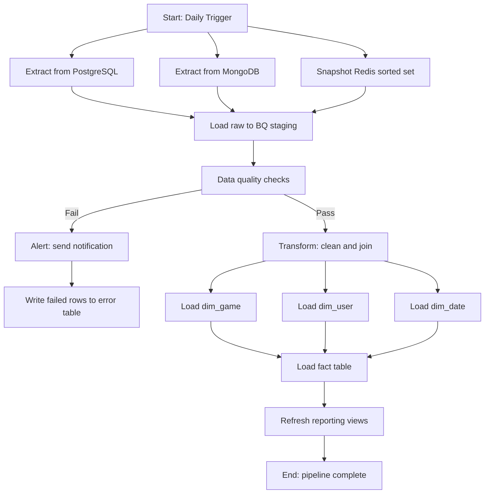
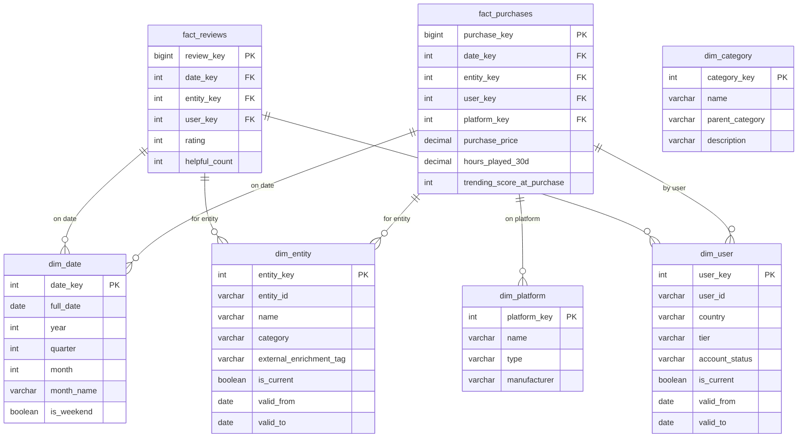

# Author: Víctor Barceló

# Group Work: Data Warehouse Architecture Design — Scenario 03: BookNest: Online Bookstore and Reading Community

**Subject**: Databases and Data Engineering  
**Weight**: 10% of total subject grade  
**Group size**: 3 students  
**Presentation**: 10 minutes + questions (in front of the whole class)  
**Deliverable**: Written report + architecture diagrams + presentation slides

---

## Overview

In this group work you will design — and optionally implement — a complete data warehouse architecture for a domain-specific analytics platform. Your group is assigned one of 15 different business scenarios, each covering a different industry with its own PostgreSQL operational database. You will enrich that data with two external sources (one stored in MongoDB, one in Redis), design an ETL pipeline, and deliver the analytical data to a **Google BigQuery** data warehouse following dimensional modeling best practices.

The goal is to integrate everything you have learned in this course — relational databases, NoSQL, access control, transactions, optimization, and now data warehousing — into a single coherent architecture.

---

## Context

### The Business Scenario

Each group is assigned one of 15 business scenarios (see **Group Scenarios**). You work as a data engineering team at a company in a specific domain — gaming, music streaming, e-commerce, healthcare, airline operations, and so on. In all cases, the leadership team wants to build a self-service analytics platform so that product managers, marketing analysts, and executives can answer strategic questions about the business.

Your assigned PostgreSQL database captures day-to-day operational transactions for that domain, but it cannot serve complex analytical queries across months or years of data efficiently. You need to design a data warehouse that combines your PostgreSQL source with two additional sources (MongoDB for semi-structured enrichment data, Redis for real-time signals) to answer the business questions defined in your scenario.

The technology stack is the same for all groups.

### The Technology Stack

| Layer | Technology | Role |
|-------|-----------|------|
| Operational store | PostgreSQL (assigned domain DB) | Source of truth for transactions |
| Document enrichment | MongoDB | External game and user metadata |
| Cache / real-time store | Redis | Trending scores, leaderboards, counters |
| ETL orchestration | Apache Airflow (diagram only) | Pipeline scheduling and monitoring |
| Analytical store | Google BigQuery | OLAP data warehouse |
| BI layer | Looker Studio (optional) | Dashboards over BigQuery |

---

## Background: GCP and BigQuery

### Google Cloud Platform (GCP)

Google Cloud Platform is a suite of cloud computing services. For data engineering, the most relevant services are:

| Service | Purpose |
|---------|---------|
| **BigQuery** | Serverless, column-oriented data warehouse |
| **Cloud Storage (GCS)** | Object storage used as a staging area |
| **Dataflow** | Managed Apache Beam pipelines for ETL |
| **Cloud Composer** | Managed Apache Airflow for orchestration |
| **Pub/Sub** | Messaging service for streaming ingestion |
| **IAM** | Identity and Access Management |
| **Secret Manager** | Secure credential storage |

GCP follows a **project > dataset > table** hierarchy in BigQuery. Access control is enforced at each level through **IAM roles**.

### BigQuery Key Concepts

**Serverless architecture**: There is no infrastructure to provision. You define tables and run SQL — Google handles the compute automatically.

**Columnar storage**: BigQuery stores data by column, not by row. Analytical queries that read only a few columns out of many are extremely efficient because only the relevant columns are scanned.

**Separation of compute and storage**: Storage is persistent and cheap. Compute (slots) is consumed only during query execution. You can pause all activity without losing data.

**Pricing model**: BigQuery charges by data scanned per query (on-demand) or by reserved slots (capacity). For a student project, the free tier covers 1 TB of queries and 10 GB of storage per month.

**Partitioning and clustering**: Tables can be partitioned by date and clustered by frequently-filtered columns to reduce query cost and latency.

**Standard SQL**: BigQuery uses ANSI-standard SQL with extensions for array, struct, and window functions.

**Slots**: A slot is a unit of BigQuery compute capacity. One slot processes roughly 2 GB/s of data. Queries are automatically parallelized across many slots.

**Datasets**: A dataset is a container for tables within a project. It has a geographic region, a default expiration, and its own IAM permissions.

```
GCP Project: gameverse-analytics
  |
  +-- Dataset: staging          (raw ingested data, short TTL)
  |     +-- stg_games
  |     +-- stg_users
  |     +-- stg_events_mongo
  |     +-- stg_trending_redis
  |
  +-- Dataset: warehouse         (dimensional model, permanent)
  |     +-- dim_game
  |     +-- dim_user
  |     +-- dim_date
  |     +-- dim_platform
  |     +-- fact_purchases
  |     +-- fact_reviews
  |     +-- ...
  |
  +-- Dataset: reporting         (views and aggregates for BI tools)
        +-- v_revenue_by_genre
        +-- v_user_engagement
        +-- ...
```

---

## The Data Landscape

### Source 1: PostgreSQL — Assigned Operational Database (OLTP)

Your assigned scenario includes a PostgreSQL operational database specific to your business domain. It contains the core transactional tables for that domain — orders, users, products, bookings, events, or whatever entities are relevant to your scenario. The exact schema (table names and key columns) is defined in your scenario section.

This is your primary source of truth.

### Source 2: MongoDB — External Enrichment (your group's assigned source)

Each group enriches the GameVerse data with one external public dataset stored as a MongoDB collection. The specific dataset is assigned per group (see the **Your Scenario** section below).

MongoDB is used here because the external data is semi-structured, nested, and schema-variable — a natural fit for document storage.

### Source 3: Redis — Real-Time Metrics

Each group enriches the pipeline with one real-time or high-frequency signal stored in Redis. The specific signal is assigned per group.

Redis is used here because the data is computed frequently, used for lookups, and benefits from in-memory speed (leaderboards, counters, trending scores).

---

## Architecture Overview

Your full architecture follows this flow:

```
SOURCES                  STAGING (GCS / BQ)       WAREHOUSE (BigQuery)
---------                ------------------        --------------------

PostgreSQL                                          dim_entity_1
  (assigned OLTP   ----> |                          dim_entity_2
   tables)               | ETL Pipeline             dim_date
                         | (Airflow DAG)  ------->  dim_entity_3
MongoDB                  |                          dim_entity_4
  (external        ----> |                          ...
   enrichment)           |
                         |                          fact_table_1
Redis                    |                          fact_table_2
  (real-time       ----> |                          (scenario-specific)
   signal)               |
```

---

## Deliverables

Your report must include all of the following sections. There is no strict page limit, but quality and clarity matter more than length.

### Section 1: Architecture Overview (required)

Provide a high-level diagram of your complete architecture, from sources to BigQuery. The diagram must show:

- All data sources with their technology label
- The staging area
- The ETL/ELT pipeline
- The BigQuery dimensional model (fact and dimension tables)
- The BI/reporting layer (even if not implemented)
- Data flow direction

Use any diagramming tool (draw.io, Mermaid, Lucidchart, excalidraw, etc.).

### Section 2: Source Systems — Design and Documentation (required)

For each of the three source systems you must both **design** the full data model and **justify** the technology choice. Receiving a business scenario does not mean the schemas are already given to you — designing them is part of the work.

For each source provide:

1. Justify why that technology is appropriate for the data it holds in your domain.
2. Design and document the schema or data structure (detailed requirements below).
3. Identify what data you will extract and why it is relevant to the analytical questions.
4. Define the **access control** for read access to that source: which role, with which permissions, and why (principle of least privilege).

#### PostgreSQL — Relational Model

Design the full relational schema for your assigned operational domain. You must:

- Define all tables with their columns, data types, and constraints (NOT NULL, UNIQUE, CHECK where meaningful).
- Identify primary keys and foreign keys for every table.
- Define at least one index per table beyond the primary key, justified by query patterns.
- Produce an **Entity-Relationship (ER) diagram** showing all entities, attributes, relationships, cardinality, and participation constraints.

Your schema must model a realistic operational database — normalise to at least 3NF. Aim for 6 to 10 tables that capture the core processes of the domain.

#### MongoDB — Document Schema

Design the document schema for your assigned enrichment collection. You must:

- Define the collection name and purpose.
- Describe all fields with their BSON types.
- Show which fields are nested documents or arrays and justify why they are not flattened.
- Provide one complete example document in JSON format.
- Explain your indexing strategy for the collection.

#### Redis — Data Model

Design the Redis data model for your assigned real-time signal. You must:

- Define the key naming convention (e.g., `trending:items:{category_id}`).
- Specify the Redis data type (string, hash, sorted set, list, set, or stream) and justify the choice.
- Describe the fields and values stored.
- Define the TTL (time-to-live) policy if applicable.
- Describe who writes to these keys, how often, and what reads them.

### Section 3: ETL Pipeline Design (required)

Describe the full ETL process from sources to BigQuery. You must address each of the following areas:

#### 3a. Extraction

- How is data extracted from each source (full dump, incremental, CDC, API call)?
- What is the extraction frequency (real-time, hourly, daily)?
- Where is the raw data landed first (staging tables in BigQuery, GCS bucket)?

#### 3b. Transformation

Describe all transformations applied. At minimum you must address:

- **Data cleaning**: Handling nulls, invalid values, duplicates.
- **Data type standardization**: Dates, currencies, enumerations.
- **Entity resolution**: How are entities from different sources joined? (e.g., game titles in MongoDB may not match `game_id` in PostgreSQL — how do you link them?)
- **Business logic**: Any computed columns or derived metrics.
- **Slowly Changing Dimensions (SCD)**: Which dimensions change over time and what SCD type do you apply? Justify your choice.

#### 3c. Loading

- Describe the loading strategy: full refresh vs. incremental (upsert/merge).
- Explain how you handle partial pipeline failures (idempotency).
- Describe how the staging layer differs from the warehouse layer.

#### 3d. Data Quality Checks

List at least five concrete data quality checks you would implement before loading data into the warehouse. For each check, state:

- What is being checked
- At what point in the pipeline
- What happens if the check fails (reject row, alert, halt pipeline)

**Example format:**

| Check | When | Failure action |
|-------|------|---------------|
| `purchase_price > 0` on `user_library` | After extraction from PostgreSQL | Reject row, log to error table |
| `game_id` in MongoDB matches a known `game_id` in PostgreSQL | After entity resolution | Flag as unmatched, exclude from warehouse load |

#### 3e. Transactions and Delivery Guarantees

Address the following:

- Your ETL pipeline will occasionally fail mid-run. How do you ensure data is not duplicated or lost? (Think: at-least-once vs. exactly-once semantics.)
- How do you handle the case where a source system is temporarily unavailable?
- Define a **retry policy** for failed pipeline stages.

### Section 4: Dimensional Model (required)

Design the BigQuery dimensional model (star or snowflake schema) for your assigned analytical use case.

#### 4a. Fact Table(s)

Define at least two fact tables. For each fact table provide:

- Table name and grain (what does one row represent?)
- All columns with data type and description
- Foreign keys to dimension tables
- List of additive measures (facts)
- Partitioning and clustering strategy

#### 4b. Dimension Tables

Define at least five dimension tables. For each dimension:

- Table name and description
- All columns with data type
- Which columns are subject to Slowly Changing Dimensions (SCD)
- SCD strategy applied (Type 1, 2, or 3) with justification

#### 4c. Schema Diagram

Provide a visual diagram (star or snowflake) showing the relationships between your fact and dimension tables.

#### 4d. Sample Analytical Queries

Write three SQL queries that answer business questions against your dimensional model. Each query must use at least one JOIN between the fact table and a dimension.

### Section 5: Access Control (required)

Define access control for the entire pipeline. Your answer must cover:

| Component | Principals | Permissions granted | Reason |
|-----------|-----------|--------------------|----|
| PostgreSQL source | ETL service account | SELECT on relevant tables only | Least privilege |
| MongoDB source | ETL service account | read role on assigned collection | Least privilege |
| Redis source | ETL service account | GET/HGET/ZRANGE on relevant keys | Least privilege |
| BigQuery staging dataset | ETL service account, data engineers | `roles/bigquery.dataEditor` | Load and transform |
| BigQuery warehouse dataset | Analysts | `roles/bigquery.dataViewer` | Read-only analytics |
| BigQuery warehouse dataset | ETL service account | `roles/bigquery.dataEditor` | Write transformed data |
| GCP project | Admins only | `roles/owner` or `roles/bigquery.admin` | Administration |

Extend this table with any additional principals specific to your use case. Also address:

- How are credentials stored? (No plaintext passwords. Mention GCP Secret Manager or environment variables.)
- How is network access restricted? (VPC, private IP, firewall rules.)
- How would you audit who accessed sensitive user data?

### Section 6: Reliability, Availability, and Delivery (required)

Address the following questions concisely:

1. **Availability**: What is the expected availability of each component (PostgreSQL, MongoDB, Redis, BigQuery)? How does a failure in one source affect the pipeline?
2. **Data freshness SLA**: How fresh does the data in BigQuery need to be for your use case? Define an SLA (e.g., "data must be no older than 4 hours").
3. **Dead letter handling**: What happens to rows that fail transformation? Where are they stored and how are they reprocessed?
4. **Backfill strategy**: If the pipeline fails for 3 days, how do you backfill the missing data?
5. **Monitoring**: List at least three metrics or alerts you would set up to detect pipeline health issues.

### Section 7: Orchestration Diagram (required)

Design the Airflow DAG (Directed Acyclic Graph) for your pipeline as a diagram. The diagram must show:

- Each task (rectangle) with a descriptive name
- Dependencies between tasks (arrows)
- Branching for parallel extraction from different sources
- At least one data quality gate task
- Alerting/notification task on failure

You do not need to write Airflow Python code, but you must describe what each task does in 1-2 sentences.

**Recommended tool**: draw.io, Mermaid, or any diagramming tool of your choice.

### Section 8: GCP and BigQuery Overview (required)

Provide a 1-2 page written overview (in your own words) covering:

- What is Google Cloud Platform and where BigQuery fits within it.
- How BigQuery differs from a traditional on-premises data warehouse.
- The BigQuery pricing model and why it matters for cost governance.
- How partitioning and clustering reduce query cost.
- What IAM roles are available in BigQuery and how they map to your access control design.

This section should be written so that a classmate who has not read the course introduction to data warehousing could understand the basics.

### Section 9: Optional Implementation

Implementation is optional. If your group chooses to implement any part of the pipeline, you will receive up to **1 bonus point** on this work (capped at the maximum grade). Partial implementations are accepted.

Suggested implementation tasks (pick any):

- Load the GameVerse PostgreSQL data into BigQuery staging tables using Python.
- Implement the MongoDB collection schema and insert sample enrichment documents.
- Write the transformation SQL queries (dbt models or plain SQL) to populate fact and dimension tables in BigQuery.
- Implement two or more of the data quality checks in Python or SQL.
- Create a Looker Studio dashboard (formerly Google Data Studio) connecting to your BigQuery warehouse tables.

If you implement any part, include the code in an appendix and provide brief instructions for running it.

---

---

## Your Scenario

Each group is assigned one scenario. The scenario defines the business domain, the analytical questions to answer, the external enrichment source for MongoDB, the real-time signal type for Redis, and an SCD challenge. The scenario does **not** give you the database schema — designing the schemas is part of the work (see Section 2).

For each scenario the following are provided:

- **Domain**: the industry and business context.
- **Analytical questions**: what the warehouse must answer.
- **PostgreSQL core entities**: the main business concepts your OLTP schema must capture (design the tables yourself).
- **MongoDB enrichment**: what external data to collect and from which public source or mock dataset.
- **Redis signal**: the real-time data type and access pattern.
- **SCD challenge**: at least one slowly changing attribute to handle in the warehouse.
- **Suggested analytical focus**: starting points for your fact and dimension table design.

---

### Scenario 03 — BookNest: Online Bookstore and Reading Community

**Domain**: An e-commerce platform that sells physical and digital books. Users can rate and review books, join reading clubs, maintain wishlists, and track their reading progress.

**Analytical questions**:
- Which genres, authors, and formats (physical vs. digital) drive the most revenue?
- How do user ratings and review volume correlate with subsequent sales?
- Which books have the highest abandon rate (started but not finished)?
- How effective are reading clubs at increasing purchase frequency per member?
- Which publishers have the strongest backlist performance (older books still selling)?

**PostgreSQL core entities**: books, authors, publishers, genres, formats (physical/ebook/audiobook), users, orders, order items, reviews, reading progress records, reading clubs, club memberships.

**MongoDB enrichment**: Enrich the book catalog with bibliographic metadata from the **Open Library API** (https://openlibrary.org/developers/api — completely free, no authentication). Each document enriches one ISBN with cover image URL, subjects (array), number of pages, description, first publish year, and edition count.

**Redis signal**: Sorted set of current bestsellers by genre. Scores are a composite of units sold in the last 7 days. Updated daily. Separate sorted sets per genre key.

**SCD challenge**: A book's price changes during promotions. An author may change their primary publisher between editions. Design your dimensions to capture the price paid at order time and the publisher relationship history.

**Suggested analytical focus**: order line fact (one row per book per order), reading progress fact (daily snapshot of pages read per user per book), book dimension, author dimension, publisher dimension, user dimension, date dimension, format dimension.

---

## Assessment Rubric

| Section | Max points | Criteria |
|---------|-----------|---------|
| Architecture Overview (diagram quality and completeness) | 15 | All components present, clear data flow, correct technology labels |
| Source Systems (schema design, ER diagram, justified technology choice, access control) | 15 | PostgreSQL ER diagram correct and normalised, MongoDB document schema with example, Redis key model defined, least-privilege access for all three |
| ETL Pipeline Design | 20 | Covers extraction, transformation, loading, data quality checks, delivery guarantees |
| Dimensional Model | 20 | At least 2 fact tables with correct grain, at least 5 dimensions, SCD handled correctly, sample queries work |
| Access Control (end-to-end) | 10 | All layers covered, credentials not hardcoded, principle of least privilege |
| Reliability and Availability | 10 | SLA defined, failure scenarios addressed, retry policy, monitoring |
| Orchestration Diagram | 10 | DAG is complete, has parallel branches, data quality gates, alert tasks |
| GCP and BigQuery Overview | 10 | Accurate, written in own words, covers pricing and IAM |
| Bonus: Implementation | +10 | Any working code or deployed component (capped at maximum grade) |
| **Total** | **110** | |

Grades are assigned to the **group as a whole**, with the following individual adjustment:

- If one group member did not contribute visibly to the report or the presentation, that member's individual grade may be reduced by up to 20%.
- Each group member must be able to answer questions about any part of the report during the presentation.

---

## Presentation Guidelines

**Duration**: 10 minutes + up to 5 minutes of questions.

**Audience**: The whole class, including students who were assigned a different variation.

**Required slides**:

1. Title slide (group members, scenario number and name)
2. The business questions your scenario addresses (1 slide)
3. Architecture diagram (1 slide)
4. Source systems: ER diagram (PostgreSQL), document schema (MongoDB), Redis key model, and what you extract from each (2 slides)
5. ETL pipeline: your transformation logic and data quality checks (1-2 slides)
6. Dimensional model: fact and dimension tables (1-2 slides, include schema diagram)
7. Access control summary (1 slide)
8. One sample BigQuery analytical query with the expected result (1 slide)
9. Key design decisions and trade-offs you made (1 slide)
10. Optional: live demo or screenshot of implementation (1 slide)

**Presentation tips**:

- All three members must speak.
- Do not read the slides. Explain the design decisions.
- Expect questions such as: "Why did you choose SCD Type 2 instead of Type 1 for that dimension?", "What happens if the MongoDB source is down?", or "How would your pipeline handle a sudden 10x increase in data volume?"

---

## Suggested Timeline

| Week | Milestone |
|------|-----------|
| Week 1 | Read the brief. Agree on group scenario with teacher. Study the business domain. Design the PostgreSQL relational model (ER diagram). Sketch the overall architecture. |
| Week 2 | Define the MongoDB document schema and Redis data model. Draft the ETL pipeline design. Start the dimensional model. |
| Week 3 | Complete the dimensional model, access control, and reliability sections. Write the GCP/BigQuery overview. Start slides. |
| Week 4 | Finalize report. Rehearse presentation. Implement optional bonus if attempted. |

---

## Useful Resources

**Data warehousing and dimensional modeling**
- Kimball Group dimensional modeling techniques: https://www.kimballgroup.com/data-warehouse-business-intelligence-resources/kimball-techniques/dimensional-modeling-techniques/
- Data Warehousing introduction (course notes): `data_warehousing/data_warehousing_introduction.md`

**Google Cloud Platform and BigQuery**
- BigQuery documentation: https://cloud.google.com/bigquery/docs
- BigQuery free tier details: https://cloud.google.com/bigquery/pricing#free-tier
- GCP IAM roles for BigQuery: https://cloud.google.com/bigquery/docs/access-control
- BigQuery partitioning and clustering: https://cloud.google.com/bigquery/docs/partitioned-tables

**ETL and orchestration**
- Apache Airflow core concepts (DAGs): https://airflow.apache.org/docs/apache-airflow/stable/core-concepts/dags.html
- dbt (data build tool): https://docs.getdbt.com
- Data quality with Great Expectations: https://docs.greatexpectations.io

**Schema design**
- Mermaid ER diagram syntax: https://mermaid.js.org/syntax/entityRelationshipDiagram.html
- draw.io (free diagramming tool): https://app.diagrams.net

**Public data sources (use those listed in your scenario)**
- Open Library API: https://openlibrary.org/developers/api
- MusicBrainz API: https://musicbrainz.org/doc/MusicBrainz_API
- Open-Meteo weather API: https://open-meteo.com
- OMDb movie API: http://www.omdbapi.com
- TMDB movie API: https://developer.themoviedb.org
- RAWG game API: https://rawg.io/apidocs
- WHO ICD API: https://icd.who.int/icdapi
- API-Football: https://www.api-football.com
- UK Food Hygiene data: https://ratings.food.gov.uk/open-data

---

## Appendix A: Schema Design Guidance

The PostgreSQL schema for your group is **not given** — you must design it as part of Section 2. Your scenario describes the business domain and the core entities. You decide the table names, columns, data types, constraints, and relationships.

**Checklist for your PostgreSQL schema:**
- Every table has a surrogate primary key (e.g., `SERIAL` or `BIGSERIAL`).
- Foreign keys reference primary keys of related tables.
- At least one `NOT NULL` constraint per meaningful column.
- At least one `UNIQUE` constraint where natural uniqueness exists.
- At least one index per table justified by a realistic query pattern.
- The schema is in 3NF: no transitive dependencies.
- The ER diagram matches the SQL schema exactly.

**Checklist for your MongoDB document schema:**
- Collection name and purpose stated.
- All fields listed with BSON types.
- One complete example document in valid JSON.
- At least one array or nested document field (justified).
- Indexing strategy explained.

**Checklist for your Redis data model:**
- Key naming convention defined (pattern with placeholders).
- Data type specified and justified.
- All fields/members described.
- TTL policy stated.
- Writer and reader processes identified.

For groups assigned **Scenario 01 — GameVerse**, a reference SQL schema with scripts is available in the course repository at `databases/postgresql/game-database/` as an example. You may extend or adapt it, but you must document whatever schema you actually use.

---

## Appendix B: Example Orchestration Diagram (Mermaid)

The following is a minimal example DAG structure to inspire your own design. Your diagram should be specific to your variation and considerably more detailed.



---

## Appendix C: Mermaid Star Schema Example

Use a similar structure to document your dimensional model. Note that your model must include **at least two fact tables** and **at least five dimensions**. This example shows two fact tables sharing several dimensions (a galaxy/fact constellation pattern).


