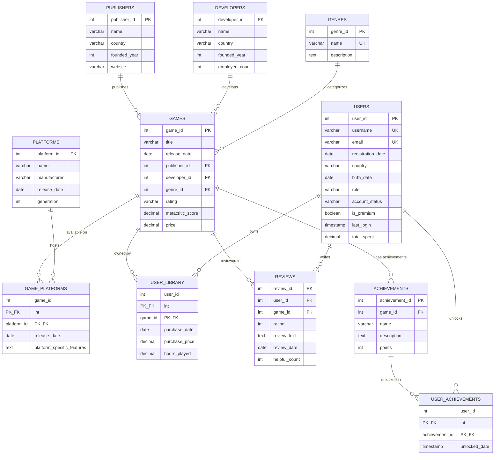

# GameVerse Database - Overview & Schema Documentation

## Introduction

**GameVerse** is a comprehensive relational database designed to manage a video game distribution platform. It tracks games, publishers, developers, platforms, user libraries, reviews, and achievements.

**Database Type:** PostgreSQL  
**Purpose:** Educational database for learning SQL, data modeling, and database management  
**Last Updated:** February 17, 2026

---

## Entity-Relationship Diagram



---

## Database Architecture

### Core Entities (Independent Tables)

#### 1. PUBLISHERS
**Purpose:** Stores information about game publishing companies.

| Column | Type | Constraints | Description |
|--------|------|-------------|-------------|
| publisher_id | SERIAL | PRIMARY KEY | Auto-incrementing unique identifier |
| name | VARCHAR(100) | NOT NULL | Publisher company name |
| country | VARCHAR(50) | | Country of origin |
| founded_year | INT | | Year the company was founded |
| website | VARCHAR(200) | | Official website URL |

**Example Data:** Nintendo, Sony Interactive, Microsoft Gaming, Electronic Arts

---

#### 2. DEVELOPERS
**Purpose:** Stores information about game development studios.

| Column | Type | Constraints | Description |
|--------|------|-------------|-------------|
| developer_id | SERIAL | PRIMARY KEY | Auto-incrementing unique identifier |
| name | VARCHAR(100) | NOT NULL | Developer studio name |
| country | VARCHAR(50) | | Country of origin |
| founded_year | INT | | Year the studio was founded |
| employee_count | INT | | Number of employees |

**Example Data:** Nintendo EPD, Naughty Dog, CD Projekt Red, FromSoftware

---

#### 3. GENRES
**Purpose:** Categorizes games by type/genre.

| Column | Type | Constraints | Description |
|--------|------|-------------|-------------|
| genre_id | SERIAL | PRIMARY KEY | Auto-incrementing unique identifier |
| name | VARCHAR(50) | NOT NULL, UNIQUE | Genre name |
| description | TEXT | | Detailed genre description |

**Example Data:** Action, RPG, Adventure, Strategy, Sports, Puzzle

---

#### 4. PLATFORMS
**Purpose:** Stores gaming platforms and consoles.

| Column | Type | Constraints | Description |
|--------|------|-------------|-------------|
| platform_id | SERIAL | PRIMARY KEY | Auto-incrementing unique identifier |
| name | VARCHAR(50) | NOT NULL | Platform name |
| manufacturer | VARCHAR(50) | | Company that made the platform |
| release_date | DATE | | When the platform was released |
| generation | INT | | Console generation (7, 8, 9, etc.) |

**Example Data:** PlayStation 5, Xbox Series X, Nintendo Switch, PC, Steam Deck

---

#### 5. USERS
**Purpose:** Stores user account information.

| Column | Type | Constraints | Description |
|--------|------|-------------|-------------|
| user_id | SERIAL | PRIMARY KEY | Auto-incrementing unique identifier |
| username | VARCHAR(50) | NOT NULL, UNIQUE | User's display name |
| email | VARCHAR(100) | NOT NULL, UNIQUE | User's email address |
| registration_date | DATE | DEFAULT CURRENT_DATE | When user registered |
| country | VARCHAR(50) | | User's country |
| birth_date | DATE | | User's date of birth |
| role | VARCHAR(20) | DEFAULT 'user', CHECK | User type: user, moderator, analyst, admin |
| account_status | VARCHAR(20) | DEFAULT 'active', CHECK | Status: active, suspended, banned |
| is_premium | BOOLEAN | DEFAULT FALSE | Premium membership status |
| last_login | TIMESTAMP | | Last login timestamp |
| total_spent | DECIMAL(10,2) | DEFAULT 0.00 | Total money spent on platform |

**Business Rules:**
- Role must be one of: 'user', 'moderator', 'analyst', 'admin'
- Account status must be: 'active', 'suspended', 'banned'
- Username and email must be unique

---

### Dependent Entities (With Foreign Keys)

#### 6. GAMES
**Purpose:** Central table storing video game information.

| Column | Type | Constraints | Description |
|--------|------|-------------|-------------|
| game_id | SERIAL | PRIMARY KEY | Auto-incrementing unique identifier |
| title | VARCHAR(200) | NOT NULL | Game title |
| release_date | DATE | | When game was released |
| publisher_id | INT | FOREIGN KEY → publishers | Who published the game |
| developer_id | INT | FOREIGN KEY → developers | Who developed the game |
| genre_id | INT | FOREIGN KEY → genres | Game genre/category |
| rating | VARCHAR(10) | | ESRB rating (E, E10+, T, M, etc.) |
| metacritic_score | DECIMAL(4,2) | | Critical reception score (0-100) |
| price | DECIMAL(6,2) | | Current price in USD |

**Relationships:**
- Each game has ONE publisher (many-to-one)
- Each game has ONE developer (many-to-one)
- Each game belongs to ONE genre (many-to-one)

---

#### 7. REVIEWS
**Purpose:** Stores user reviews and ratings for games.

| Column | Type | Constraints | Description |
|--------|------|-------------|-------------|
| review_id | SERIAL | PRIMARY KEY | Auto-incrementing unique identifier |
| user_id | INT | FOREIGN KEY → users | Who wrote the review |
| game_id | INT | FOREIGN KEY → games | Which game is being reviewed |
| rating | INT | CHECK (1-10) | User's numerical rating |
| review_text | TEXT | | Written review content |
| review_date | DATE | DEFAULT CURRENT_DATE | When review was posted |
| helpful_count | INT | DEFAULT 0 | Number of "helpful" votes |

**Business Rules:**
- Rating must be between 1 and 10 (inclusive)
- Users can review each game only once (implied by business logic)

---

#### 8. ACHIEVEMENTS
**Purpose:** Stores in-game achievements for each game.

| Column | Type | Constraints | Description |
|--------|------|-------------|-------------|
| achievement_id | SERIAL | PRIMARY KEY | Auto-incrementing unique identifier |
| game_id | INT | FOREIGN KEY → games | Which game this achievement belongs to |
| name | VARCHAR(100) | NOT NULL | Achievement name |
| description | TEXT | | How to unlock the achievement |
| points | INT | DEFAULT 10 | Achievement point value |

**Example:** "First Victory" - Win your first match (10 points)

---

### Junction Tables (Many-to-Many Relationships)

#### 9. GAME_PLATFORMS
**Purpose:** Connects games to platforms (many-to-many relationship).

| Column | Type | Constraints | Description |
|--------|------|-------------|-------------|
| game_id | INT | PRIMARY KEY, FOREIGN KEY → games | Game identifier |
| platform_id | INT | PRIMARY KEY, FOREIGN KEY → platforms | Platform identifier |
| release_date | DATE | | Platform-specific release date |
| platform_specific_features | TEXT | | Special features for this platform |

**Why This Table Exists:**
- One game can be on multiple platforms (e.g., Cyberpunk on PC, PS5, Xbox)
- One platform has many games (e.g., PS5 has thousands of games)
- Allows storing platform-specific data (different release dates, exclusive features)

**Composite Primary Key:** (game_id, platform_id) - prevents duplicate entries

---

#### 10. USER_LIBRARY
**Purpose:** Tracks which games users own (many-to-many relationship).

| Column | Type | Constraints | Description |
|--------|------|-------------|-------------|
| user_id | INT | PRIMARY KEY, FOREIGN KEY → users | User identifier |
| game_id | INT | PRIMARY KEY, FOREIGN KEY → games | Game identifier |
| purchase_date | DATE | | When the game was purchased |
| purchase_price | DECIMAL(6,2) | | Price paid for the game |
| hours_played | DECIMAL(8,2) | DEFAULT 0 | Total gameplay hours |

**Business Logic:**
- One user can own many games
- One game can be owned by many users
- Tracks purchase history and gameplay time

**Composite Primary Key:** (user_id, game_id) - a user can own each game only once

---

#### 11. USER_ACHIEVEMENTS
**Purpose:** Tracks which achievements users have unlocked (many-to-many relationship).

| Column | Type | Constraints | Description |
|--------|------|-------------|-------------|
| user_id | INT | PRIMARY KEY, FOREIGN KEY → users | User identifier |
| achievement_id | INT | PRIMARY KEY, FOREIGN KEY → achievements | Achievement identifier |
| unlocked_date | TIMESTAMP | DEFAULT CURRENT_TIMESTAMP | When achievement was unlocked |

**Business Logic:**
- One user can unlock many achievements
- One achievement can be unlocked by many users
- Tracks when each achievement was earned

**Composite Primary Key:** (user_id, achievement_id) - prevents duplicate unlocks

---

## Relationships Summary

### One-to-Many Relationships

1. **PUBLISHERS → GAMES**
   - One publisher publishes many games
   - Each game has one publisher

2. **DEVELOPERS → GAMES**
   - One developer creates many games
   - Each game has one developer

3. **GENRES → GAMES**
   - One genre categorizes many games
   - Each game belongs to one genre

4. **GAMES → REVIEWS**
   - One game has many reviews
   - Each review is for one game

5. **USERS → REVIEWS**
   - One user writes many reviews
   - Each review is written by one user

6. **GAMES → ACHIEVEMENTS**
   - One game has many achievements
   - Each achievement belongs to one game

### Many-to-Many Relationships

1. **GAMES ↔ PLATFORMS** (via GAME_PLATFORMS)
   - Games available on multiple platforms
   - Platforms host multiple games

2. **USERS ↔ GAMES** (via USER_LIBRARY)
   - Users own multiple games
   - Games owned by multiple users

3. **USERS ↔ ACHIEVEMENTS** (via USER_ACHIEVEMENTS)
   - Users unlock multiple achievements
   - Achievements unlocked by multiple users

---

## Key Features & Constraints

### Data Integrity

**Primary Keys:**
- All tables have primary keys to ensure unique identification
- SERIAL type used for auto-incrementing IDs

**Foreign Keys:**
- Enforce referential integrity
- Prevent orphaned records
- Ensure valid relationships

**Unique Constraints:**
- `genres.name` - prevents duplicate genre names
- `users.username` - unique usernames
- `users.email` - unique email addresses

**Check Constraints:**
- `reviews.rating` - must be between 1 and 10
- `users.role` - must be valid role type
- `users.account_status` - must be valid status

**Default Values:**
- `users.registration_date` - automatically set to current date
- `users.is_premium` - defaults to FALSE
- `users.total_spent` - defaults to 0.00
- `achievements.points` - defaults to 10

### Composite Primary Keys

Used in junction tables to prevent duplicate entries:
- `game_platforms (game_id, platform_id)`
- `user_library (user_id, game_id)`
- `user_achievements (user_id, achievement_id)`

---

## Common Query Patterns

### Find all games by a publisher
```sql
SELECT g.title, p.name AS publisher
FROM games g
JOIN publishers p ON g.publisher_id = p.publisher_id
WHERE p.name = 'Nintendo';
```

### Get user's game library
```sql
SELECT u.username, g.title, ul.purchase_date, ul.hours_played
FROM users u
JOIN user_library ul ON u.user_id = ul.user_id
JOIN games g ON ul.game_id = g.game_id
WHERE u.username = 'player1';
```

### Find games available on specific platform
```sql
SELECT g.title, p.name AS platform
FROM games g
JOIN game_platforms gp ON g.game_id = gp.game_id
JOIN platforms p ON gp.platform_id = p.platform_id
WHERE p.name = 'PC';
```

### Get game reviews with user info
```sql
SELECT g.title, u.username, r.rating, r.review_text
FROM reviews r
JOIN games g ON r.game_id = g.game_id
JOIN users u ON r.user_id = u.user_id
ORDER BY r.review_date DESC;
```

### Track achievement progress
```sql
SELECT u.username, 
       COUNT(ua.achievement_id) AS achievements_unlocked,
       (SELECT COUNT(*) FROM achievements WHERE game_id = 1) AS total_achievements
FROM users u
LEFT JOIN user_achievements ua ON u.user_id = ua.user_id
LEFT JOIN achievements a ON ua.achievement_id = a.achievement_id
WHERE a.game_id = 1
GROUP BY u.username;
```

---

## Use Cases

### For Game Store Platform
- Browse games by genre, platform, publisher
- Purchase games and track library
- Write and read reviews
- Track achievements and progress
- User account management

### For Business Analytics
- Sales analysis by region, genre, platform
- User engagement metrics (hours played, reviews)
- Popular games and trending titles
- Publisher and developer performance
- Revenue tracking

### For Content Moderation
- Monitor and moderate user reviews
- Manage user accounts (suspend/ban)
- Track user activity and behavior

### For Educational Purposes
- Learn SQL queries (SELECT, JOIN, GROUP BY)
- Practice data modeling
- Understand database relationships
- Learn access control and security
- Study transaction management

---

## Database Statistics

**Total Tables:** 11
- **Core Entities:** 5 (Publishers, Developers, Genres, Platforms, Users)
- **Dependent Entities:** 3 (Games, Reviews, Achievements)
- **Junction Tables:** 3 (Game_Platforms, User_Library, User_Achievements)

**Relationships:**
- **One-to-Many:** 6 relationships
- **Many-to-Many:** 3 relationships

**Primary Keys:** 11 (one per table)  
**Foreign Keys:** 12  
**Unique Constraints:** 3  
**Check Constraints:** 3  
**Default Values:** 7

---

## Indexing Recommendations

For optimal query performance, consider adding indexes on:

```sql
-- Foreign keys (often queried)
CREATE INDEX idx_games_publisher ON games(publisher_id);
CREATE INDEX idx_games_developer ON games(developer_id);
CREATE INDEX idx_games_genre ON games(genre_id);
CREATE INDEX idx_reviews_game ON reviews(game_id);
CREATE INDEX idx_reviews_user ON reviews(user_id);

-- Frequently searched columns
CREATE INDEX idx_games_title ON games(title);
CREATE INDEX idx_users_username ON users(username);
CREATE INDEX idx_users_email ON users(email);

-- Date columns for time-based queries
CREATE INDEX idx_games_release_date ON games(release_date);
CREATE INDEX idx_user_library_purchase_date ON user_library(purchase_date);
```

---

## Future Enhancements

Potential additions to extend the database:

1. **Wishlists:** Track games users want to purchase
2. **Friends System:** Social connections between users
3. **Game Downloads:** Track download history and versions
4. **DLC/Expansions:** Additional content for games
5. **User Preferences:** Settings, themes, notification preferences
6. **Payment Methods:** Store payment information
7. **Sales/Discounts:** Promotional pricing history
8. **Game Updates:** Version tracking and patch notes
9. **Multiplayer Stats:** Leaderboards, match history
10. **Streaming Integration:** Twitch/YouTube connections

---

## Related Files

- [create_database.sql](create_database.sql) - Database creation script
- [create_tables.sql](create_tables.sql) - Table creation with all constraints
- [insert_data.sql](insert_data.sql) - Sample data insertion
- [class_exercises.md](class_exercises.md) - SQL practice exercises
- [class_exercises_solutions.md](class_exercises_solutions.md) - Exercise solutions
- [access_control_exercises.md](access_control_exercises.md) - Security exercises
- [transactions_exercises.md](transactions_exercises.md) - Transaction control exercises

---

**Documentation Version:** 1.0  
**Last Updated:** February 17, 2026  
**Database Version:** PostgreSQL 12+
